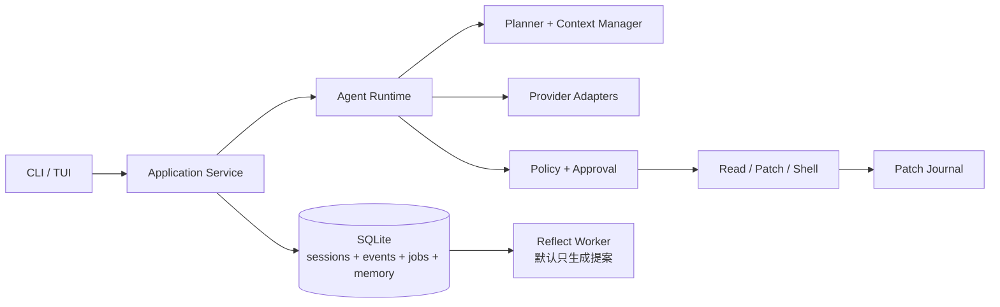
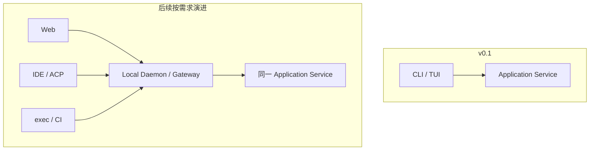
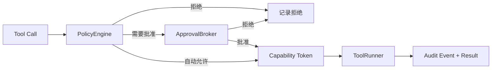
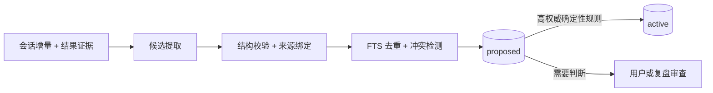
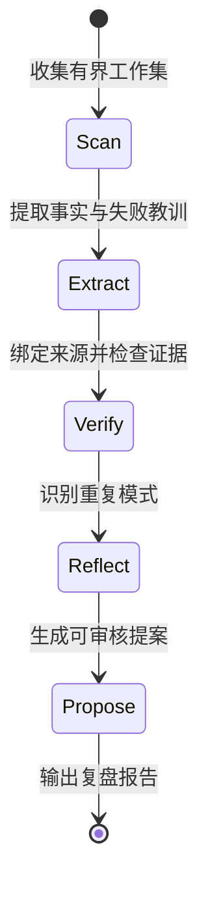

# MengDie Code / 梦蝶 Code — 架构设计

> 名称：**MengDie Code / 梦蝶 Code**  
> CLI 命令：`mengdie`  
> Slogan：**不是记得更多，而是记得更对。**  
> 项目代号源自《庄子·齐物论》“庄周梦蝶”：清醒时协作编码，空闲时复盘经验。  
> 文档性质：产品与技术奠基蓝图，以“一名架构师利用业余时间可以独立交付”为硬约束。  
> 版本：v0.2 · 2026-07-30

---

## 1. 产品定义

### 1.1 一句话定位

MengDie Code 是一个面向国内开发者的本地 Coding Agent：兼容主流与国内模型，能够执行真实工程任务，并以**可验证、可追溯、可纠正的记忆**减少重复说明和错误假设。

它不是“Go 版 Deep Agents”，也不是又一个 Agent 框架。Deep Agents 提供了有价值的产品理念——规划、文件系统、上下文管理、子 Agent——MengDie Code 吸收这些理念，但以解决开发者每天遇到的具体问题为目标。

### 1.2 核心用户痛点

| 用户场景 | 现有痛点 | MengDie Code 的答案 |
|---|---|---|
| 重返一个项目 | 每次重新说明测试命令、代码规范和已否决方案 | 项目级可信记忆，附来源和有效范围 |
| 长任务持续数十轮 | 压缩后丢失目标、决策和失败原因 | 结构化计划、事件持久化、分层上下文 |
| Agent 做出错误假设 | 不知道它为什么这样认为，错误还可能跨会话传播 | `memory why`、证据链、冲突与失效标记 |
| 修改代码后效果变差 | diff 零散、用户仓库被自动提交、难以精确撤销 | Patch Journal 与按回合 `rewind` |
| 使用国内模型 | 配置分散、兼容性不明、费用不可见 | 国内 Provider 开箱即用、能力检测、真实用量展示 |
| macOS / Windows 本地开发 | MacBook 与 Windows 是国内开发者最常见的两类本地开发环境，终端、凭据、路径和进程模型差异明显 | 两个平台都作为一等平台设计和测试，不用 Linux 行为简单外推 |

### 1.3 产品承诺

1. **能日用**：能完成真实仓库中的阅读、修改、测试与修复。
2. **值得信任**：危险操作在执行边界被拦截，所有修改可解释、可撤销。
3. **记得对**：记忆有来源、作用域、有效期和权威等级；被召回不等于被证实。
4. **会复盘**：离线阶段只基于证据提出改进建议，不在无人值守时擅自改代码或项目规则。
5. **国内友好**：中文文档、单二进制、国内模型、代理和计费体验开箱即用。

### 1.4 v0.1 明确不做

- 不做通用 Agent 框架或公开稳定 SDK。
- 不做 Web IDE；先把 CLI/TUI 日用体验做扎实。
- 不以常驻 daemon 作为运行前提。
- 不做异步 Swarm、多层 Agent 嵌套和自动合并。
- 不做向量数据库、记忆图谱和通用“艾宾浩斯遗忘曲线”。
- 不让复盘任务自动修改代码、AGENTS.md 或正式程序性记忆。
- 不承诺跨平台一致的 OS 级强沙箱；产品必须明确展示当前安全等级。

### 1.5 差异化

规划、工具、Skills、MCP、持久记忆和子 Agent 已逐渐成为 Coding Agent 的标配，不能再作为单独的护城河。MengDie Code 的差异化集中在三个可验证方向：

| 差异化 | 具体能力 | 验证方式 |
|---|---|---|
| **可信记忆** | 来源、作用域、有效期、冲突、确认状态、`why/forget/export` | 重复纠正率下降；错误召回可追踪 |
| **证据驱动复盘** | 从成功/失败轨迹提炼提案，不自动篡改正式规则 | 提案接受率；产生的后续收益 |
| **国内与双平台体验** | 国内模型、中文、单二进制、macOS 与 Windows 一等支持 | 双平台安装成功率；首次任务完成时间 |

> 产品的北极星指标不是“存了多少记忆”，而是：**同一仓库中的后续任务，用户需要重复纠正的次数是否持续下降。**

---

## 2. 设计原则

1. **先做产品闭环，再抽象框架。** 只有 Provider、存储、执行后端等真实外部边界需要早期接口；内部业务结构允许随使用反馈演进。
2. **持久存储才是事实源。** SQLite 中的事件、会话和记忆是事实源；进程和 EventBus 都是可重建的运行时。
3. **安全在工具边界强制执行。** 模型不能靠提示词自我约束；Policy、Approval、Sandbox 必须位于工具调用与真实副作用之间。
4. **来源比模型信心重要。** LLM 自评的 `confidence` 只是弱信号，不能代替用户确认、仓库事实和命令结果。
5. **召回不等于证实。** 一条记忆被检索出来只更新访问记录，不自动提高真实性或权重。
6. **上下文按需加载。** 常驻的是能力说明和小型主题目录，不是全量记忆索引；大工具结果落盘并保留指针。
7. **默认不污染用户仓库。** 不自动创建 Git commit，不擅自清理或覆盖未提交修改。
8. **复盘先提案、后自动化。** 未经指标验证，不把无人值守的模型判断直接写成正式规则。
9. **每个高级机制都必须通过评估证明价值。** 向量、图谱、衰减、子 Agent 和 daemon 都按数据决定是否引入。

---

## 3. 总体架构

### 3.1 v0.1 最小架构



核心运行模式是**单进程、本地优先**：用户运行 `mengdie`，Application Service 在同一进程内启动 Agent Runtime。这样可以先验证 Coding 与记忆闭环，避免过早承担 daemon 生命周期、IPC、双前端和远程鉴权的复杂度。

### 3.2 演进边界

Application Service 是未来客户端复用的边界。v0.1 的 CLI 直接调用它；当确实出现以下需求时，再增加 daemon：

- SSH 断开后任务仍需继续；
- 多客户端同时订阅同一会话；
- Web 或编辑器客户端需要接入；
- 后台定时复盘需要长期运行。



daemon 不是事实源。即使进程被杀死，持久事件与快照仍应允许用户恢复到最后一个稳定状态。

### 3.3 数据与控制边界

| 组件 | 职责 | 不负责 |
|---|---|---|
| Application Service | 接收命令、管理 run、协调事务和事件 | LLM 推理细节 |
| Agent Runtime | plan → model → tool → observe 循环 | 持久化策略、真实权限判断 |
| EventStore | 原子追加事件、加载事件、保存快照 | 实时 UI 广播 |
| JobStore | 持久化记忆提取与复盘任务、租约和重试状态 | 在进程退出后假装任务仍在内存中运行 |
| EventBus | 进程内实时通知与背压 | 作为历史事实源 |
| PolicyEngine | 根据工具、参数、环境和 profile 做确定性裁决 | 执行命令 |
| ApprovalBroker | 暂停、展示风险、接收用户批准/拒绝 | 绕过 Policy |
| ToolRunner | 在已授权能力范围内执行工具 | 自行提升权限 |
| MemoryService | 提取候选、检索、审计、失效 | 把推断冒充事实 |
| Reflect Worker | 离线生成复盘提案 | 自动改代码或正式规则 |

---

## 4. 会话、命令与事件

### 4.1 Command 与 Event 分离

客户端发送 Command，系统成功处理后追加 Event。Command 可以失败或被拒绝；Event 一旦持久化就是历史事实。

```go
type Command struct {
    ID        string          `json:"id"`          // 幂等键
    SessionID string          `json:"session_id"`
    Kind      string          `json:"kind"`
    Payload   json.RawMessage `json:"payload"`
}

type Event struct {
    ID        string          `json:"id"`
    SessionID string          `json:"session_id"`
    RunID     string          `json:"run_id"`
    Seq       uint64          `json:"seq"`         // 会话内单调递增
    Version   uint16          `json:"version"`     // Payload schema 版本
    Time      time.Time       `json:"time"`
    Kind      EventKind       `json:"kind"`
    Payload   json.RawMessage `json:"payload"`
}
```

首版事件至少覆盖：

```go
const (
    EventRunStarted       EventKind = "run.started"
    EventRunCompleted     EventKind = "run.completed"
    EventRunFailed        EventKind = "run.failed"
    EventRunInterrupted   EventKind = "run.interrupted"
    EventMessageDelta     EventKind = "message.delta"
    EventMessageCompleted EventKind = "message.completed"
    EventToolProposed     EventKind = "tool.proposed"
    EventApprovalNeeded   EventKind = "approval.needed"
    EventApprovalResolved EventKind = "approval.resolved"
    EventToolStarted      EventKind = "tool.started"
    EventToolCompleted    EventKind = "tool.completed"
    EventTodoUpdated      EventKind = "todo.updated"
    EventContextCompacted EventKind = "context.compacted"
    EventMemoryRecalled   EventKind = "memory.recalled"
    EventMemoryProposed   EventKind = "memory.proposed"
    EventMemoryChanged    EventKind = "memory.changed"
    EventCostUpdated      EventKind = "cost.updated"
    EventError            EventKind = "error"
)
```

### 4.2 EventStore 是事实源

```go
type EventStore interface {
    // expectedSeq 提供乐观并发控制，防止重复或乱序追加。
    Append(ctx context.Context, sessionID string, expectedSeq uint64, events []Event) error
    Load(ctx context.Context, sessionID string, afterSeq uint64, limit int) ([]Event, error)
    SaveSnapshot(ctx context.Context, snapshot SessionSnapshot) error
    LoadSnapshot(ctx context.Context, sessionID string) (*SessionSnapshot, error)
}
```

设计要求：

- Event 先落库，再通知 EventBus；UI 断线后通过 `afterSeq` 补齐。
- 流式 delta 可以分批持久化，避免逐 token 写 SQLite；完整消息以 `message.completed` 作为可重建边界。
- Command ID 必须幂等，重试不得重复执行工具。
- EventBus 对慢客户端采用有界缓冲；丢弃实时 delta 后，客户端仍可从 EventStore 恢复。
- Snapshot 只是加速手段，永远可以由 Event 重建关键会话状态。

### 4.3 崩溃恢复

恢复时根据最后事件决定动作：

| 最后状态 | 恢复策略 |
|---|---|
| 模型调用中 | 标记中断，允许用户继续，不假装续上不可恢复的流 |
| 等待审批 | 恢复审批卡片，禁止自动视为批准 |
| 只读工具执行中 | 可根据幂等性安全重试 |
| 修改型工具执行中 | 检查 Patch Journal 与文件哈希，要求用户确认恢复或回滚 |
| 已完成 | 从最终快照恢复会话与 token 统计 |

---

## 5. Agent Runtime

### 5.1 核心循环

循环保持朴素，复杂度放在上下文、Policy 和工具边界：

```go
func (a *Agent) Run(ctx context.Context, input string) error {
    if err := a.events.AppendUserMessage(ctx, input); err != nil {
        return err
    }

    // 新任务只做一次初始召回；后续由上下文缺口触发定向检索。
    recalled, err := a.memory.Recall(ctx, RecallQuery{Task: input})
    if err != nil {
        a.events.Warn(ctx, "memory recall unavailable", err)
    }
    a.context.AddMemories(recalled)

    for turn := 0; turn < a.cfg.MaxTurns; turn++ {
        req, err := a.context.Build(a.planner.State())
        if err != nil {
            return err
        }

        response, err := a.provider.Stream(ctx, req, a.streamSink())
        if err != nil {
            return a.handleProviderError(ctx, err)
        }
        if len(response.ToolCalls) == 0 {
            return a.finish(ctx, response)
        }

        // 每个调用都必须经过确定性策略与审批，不能直接 ExecuteAll。
        results, err := a.executeAuthorized(ctx, response.ToolCalls)
        if err != nil {
            return err
        }
        a.context.Append(results...)

        if a.context.ShouldCompact() {
            if err := a.context.Compact(ctx); err != nil {
                return err
            }
        }
    }
    return ErrMaxTurns
}
```

任务结束前将“会话增量 + 结果 + 验证证据”原子提交给持久化 Job Queue，再由 Memory Extractor 异步处理。该任务使用独立生命周期，不能复用已经取消的 run context；CLI 正常退出前可在短时间内尝试处理，未完成任务由下次启动继续。

### 5.2 Deep Agent 能力的落地顺序

| 能力 | v0.1 设计 | 演进条件 |
|---|---|---|
| 规划 | 内置 `write_todos`，每次只允许一个 `in_progress` | 长任务评测证明需要更复杂 DAG 后再扩展 |
| 文件系统 | 真实项目 FS + 会话 Artifact Store | 远程执行出现后增加可插拔后端 |
| 上下文管理 | token 预算、工具输出落盘、滚动摘要 | 按模型能力调优 |
| 子 Agent | v0.1 不做；先保证单 Agent 可靠 | 单 Agent 已稳定且并行任务收益可测量 |
| Skills | 项目级与用户级 `SKILL.md` 按需加载 | M2 引入，保持简单文件协议 |

### 5.3 工具并发规则

工具声明副作用与资源范围：

```go
type ToolEffect string

const (
    EffectRead    ToolEffect = "read"
    EffectWrite   ToolEffect = "write"
    EffectExecute ToolEffect = "execute"
    EffectNetwork ToolEffect = "network"
)

type ToolSpec struct {
    Name       string
    InputSchema json.RawMessage
    Effects    []ToolEffect
}
```

- 多个纯读取工具可以并行。
- 涉及 write/execute/network 的工具默认串行。
- 即使模型声明“互不依赖”，也不能绕过上述规则。
- 后续只有在工具能确定性声明读写资源集合时，才开放安全的修改并行。

---

## 6. Provider 设计

### 6.1 最小统一层 + 能力协商

“OpenAI compatible”不等于行为完全一致。不同供应商在工具流、推理内容、缓存、JSON Schema、用量统计和错误码上都有差异，因此不能只靠一个过薄的 `Chat()` 接口抹平。

```go
type Capabilities struct {
    ToolCalling      bool
    ParallelTools    bool
    ReasoningStream  bool
    PromptCache      bool
    StrictToolSchema bool
    ImageInput       bool
    MaxContextTokens int
}

type Provider interface {
    ID() string
    Capabilities(ctx context.Context, model string) (Capabilities, error)
    Stream(ctx context.Context, req ChatRequest, sink StreamSink) (*ChatResponse, error)
}
```

Provider Adapter 负责：

- 请求/响应协议转换；
- 限流、可重试错误、退避与超时；
- usage 与 prompt cache 明细；
- 保留必要的原始 provider 事件，避免高级能力被统一层永久丢失；
- 启动时执行 capability probe，并缓存结果；
- 将“模型不支持工具调用”等错误在任务开始前暴露，而不是运行中失败。

P1-03 先交付最小可验证子集：`ToolCalling`、`ParallelTools`、`UsageInStream`、`StrictToolSchema` 与配置声明的 `MaxContextTokens`。它只保留 Agent 执行所需的规范化文本、工具调用和 usage，不传播隐藏 reasoning 内容；capability probe、原始诊断事件和更多多模态能力在 P1-10 或后续里程碑按实际兼容数据增加。协议细节见 [P1-03 Provider 协议](./docs/development/phase-1-slice-03/PROVIDER_PROTOCOL.md)。

### 6.2 首发支持顺序

1. OpenAI-compatible 最小协议：覆盖 DeepSeek、Kimi、智谱等可配置端点。
2. Anthropic 原生协议。
3. 其他 Provider 根据用户需求与评测数据增加。

`cheap_model` 可以用于摘要、候选记忆提取和复盘，但必须独立计费、可关闭，并展示每类后台任务的成本。

---

## 7. 权限、安全与回滚

### 7.1 强制执行链



Capability Token 必须绑定：工具名、规范化参数摘要、工作目录、允许的资源、有效期和单次 nonce。批准 `git status` 不能被复用为批准另一个 shell 命令。

### 7.2 风险等级

| 等级 | 示例 | 默认策略 |
|---|---|---|
| Read | 读项目文件、grep、git diff | 项目根目录内自动允许 |
| Write | patch、创建文件、格式化 | 展示 diff，按会话或单次批准 |
| Execute | test、build、git 命令 | 命令级 allowlist + 环境约束 |
| Network | curl、包安装、MCP 网络工具 | 单独批准并显示目标域名 |
| Destructive | 删除、覆盖、强制 Git 操作 | 高风险确认；宽泛目标直接拒绝 |

### 7.3 跨平台安全策略

v0.1 提供所有平台共有的基础防线：

- 工作目录和路径规范化；
- 命令与参数级 Policy；
- 环境变量与敏感文件过滤；
- 网络权限独立控制；
- 超时、输出上限和进程树终止；
- 全程审计与 Patch Journal。

macOS 与 Windows 都是 Tier 1 平台：macOS 重点适配 Apple Silicon、Terminal.app/iTerm2、zsh、Keychain 与 Homebrew；Windows 重点适配 Windows Terminal、PowerShell 7、盘符/UNC/重解析点、Job Object 与安装升级体验。Linux 保持完整 CLI 支持，并可选探索 bwrap；Docker 可作为后续执行后端。任何平台如尚无可靠 OS 级隔离，UI 都必须明确显示“本地受控执行”而不是“强沙箱”，避免给用户虚假安全感。

### 7.4 Patch Journal 与 rewind

不在用户仓库中自动提交 Git commit。每次修改前记录：

- 目标路径与修改前哈希；
- 正向与逆向 patch，必要时保存小文件快照；
- 执行工具、参数摘要、run/turn ID；
- 修改后的哈希与验证结果。

`mengdie rewind` 只回滚由 MengDie Code 在对应回合产生、且当前哈希仍匹配的修改。若用户随后手工改过同一文件，必须展示冲突并停止，不能覆盖。

---

## 8. 可信记忆系统

### 8.1 目标

记忆系统不是为了积累最多文本，而是为了回答四个问题：

1. 它为什么知道这个？
2. 这条信息对哪个用户、项目、分支和时间有效？
3. 它是用户确认的事实、仓库证据，还是模型推断？
4. 如果错了，如何纠正、失效和追踪影响？

CoALA 的 working / episodic / semantic / procedural 分类保留为认知层参考，但数据库优先采用更直接影响工程可信度的维度。

### 8.2 数据模型

```go
type Memory struct {
    ID          string
    Claim       string       // 原子化、自包含陈述
    Kind        MemoryKind   // episode / fact / preference / procedure / reference
    Scope       MemoryScope  // user / project / branch / task
    Authority   Authority    // explicit / repository / verified / inferred
    Source      SourceRef    // session、文件、命令结果、用户消息
    ObservedAt  time.Time
    ValidFrom   *time.Time
    ValidUntil  *time.Time
    Status      MemoryStatus // proposed / active / stale / disputed / superseded / archived
    Confidence  float64      // 辅助信号，不单独决定是否可信
    EvidenceScore float64    // 由确认与验证记录计算，不由 LLM 直接填写
    Supersedes  string
}
```

权威等级默认顺序：

```text
用户显式规则
  > 当前仓库中可直接验证的事实
  > 成功命令或测试验证的结论
  > 多个独立会话重复观察
  > 单次模型推断
```

这不是绝对优先级：用户规则也可能过期，仓库事实也可能只对某个分支有效。冲突时保留双方及来源，不做静默文本合并。

### 8.3 何时写入

v0.1 不在每个对话轮次调用模型写记忆。只在高价值边界产生候选：

- 用户显式执行 `memory remember`；
- 用户纠正 Agent；
- todo 或任务完成；
- 测试、构建或真实验证成功/失败；
- 上下文压缩；
- 会话正常结束。

候选提取流程：



只有以下内容可以绕过候选状态直接进入 active：

- 用户明确要求记住的原子规则；
- 从受信任项目配置中确定性解析的事实；
- 已有正式记忆的纯格式迁移。

### 8.4 召回：三级按需加载

不把全量 `id + description` 永久放入系统提示词。采用三级结构：

1. **常驻能力说明**：告诉模型存在 user/project/procedure 等记忆以及如何检索。
2. **任务级主题目录**：基于项目、分支和任务筛出少量候选主题。
3. **原子记忆正文**：混合检索后只注入 topK，并附简短来源与陈旧提示。

v0.1 召回使用 SQLite FTS5 + 结构化过滤，不依赖 embedding：

```text
score = relevance
      + authority_weight
      + evidence_weight
      + task_scope_match
      + freshness_for_kind
      - conflict_penalty
```

关键规则：

- `recalled_at` 和 `recall_count` 只记录访问，不增加事实可信度。
- 只有用户确认、再次直接观察或任务验证成功才增加 evidence strength。
- 用户偏好不因时间自动衰减，但长期未确认时可以提示复核。
- 项目实现事实优先实时读取仓库；记忆只能作为检索线索，不能覆盖当前代码证据。
- 临时环境信息必须有 `ValidUntil` 或 task scope。

### 8.5 SQLite v0.1 Schema

```sql
CREATE TABLE memories (
    rowid          INTEGER PRIMARY KEY,
    id             TEXT NOT NULL UNIQUE,
    claim          TEXT NOT NULL,
    kind           TEXT NOT NULL,
    scope_kind     TEXT NOT NULL,
    scope_value    TEXT,
    authority      TEXT NOT NULL,
    source_type    TEXT NOT NULL,
    source_ref     TEXT NOT NULL,
    observed_at    DATETIME NOT NULL,
    valid_from     DATETIME,
    valid_until    DATETIME,
    status         TEXT NOT NULL,
    confidence     REAL NOT NULL,
    evidence_score REAL NOT NULL DEFAULT 0,
    supersedes     TEXT,
    created_at     DATETIME NOT NULL,
    updated_at     DATETIME NOT NULL
);

CREATE VIRTUAL TABLE memories_fts USING fts5(
    claim,
    content='memories',
    content_rowid='rowid'
);

CREATE TABLE memory_evidence (
    id          TEXT PRIMARY KEY,
    memory_id   TEXT NOT NULL,
    kind        TEXT NOT NULL,     -- user_confirmed / reobserved / task_verified
    source_ref  TEXT NOT NULL,
    weight      REAL NOT NULL,
    created_at  DATETIME NOT NULL,
    FOREIGN KEY(memory_id) REFERENCES memories(id)
);

CREATE TABLE memory_usage (
    memory_id   TEXT NOT NULL,
    session_id  TEXT NOT NULL,
    recalled_at DATETIME NOT NULL,
    outcome     TEXT,              -- unknown / helpful / harmful / unused
    PRIMARY KEY(memory_id, session_id, recalled_at),
    FOREIGN KEY(memory_id) REFERENCES memories(id)
);
```

实现时必须为 external-content FTS 表增加 insert/update/delete 同步触发器，并提供 `rebuild` 自检命令。若未来增加 embedding，必须同时存储模型、维度和版本，禁止只存一个无元数据 BLOB。

### 8.6 审计与用户控制

```text
mengdie memory list [--project] [--status]
mengdie memory show <id>
mengdie memory why <id>
mengdie memory remember "..." [--scope project]
mengdie memory forget <id> [--hard]
mengdie memory export
```

`why` 至少展示：原始来源、提取时间、作用域、确认历史、冲突链、最近在哪些任务中被召回，以及是否真正帮助任务通过验证。

### 8.7 v0.1 暂缓机制

以下能力只有在 FTS5 基线评测不能满足目标后才引入：

- embedding 与向量近邻；
- 记忆关联图；
- 全库时间衰减；
- 自动影响传播；
- 自动生成或修改 Skill；
- 复杂认知分类驱动的多库分片。

---

## 9. 复盘机制：Reflect / Consolidation

### 9.1 产品语言

- 内部模块名：`reflect` / `consolidation`。
- CLI 命令：`mengdie reflect`。
- 中文 UI 可以称“梦境报告”或“复盘报告”，保留梦蝶品牌隐喻。
- 不把“做梦”包装成已经验证的技术护城河；它必须用实际接受率和后续收益证明价值。

### 9.2 v0.1 触发方式

首版仅支持手动执行与会话结束提示，不默认启用定时无人值守任务：

```text
mengdie reflect                 # 复盘最近会话
mengdie reflect --since 7d      # 指定工作集
mengdie reflect proposals       # 查看提案
mengdie reflect approve <id>
mengdie reflect reject <id>
```

当 daemon 后续落地后，才考虑 idle/cron 触发，并且必须有预算、互斥锁和可恢复 Job Queue。

### 9.3 五阶段流水线



1. **Scan**：最近会话、todo、工具结果、测试证据、用户纠正和现有候选记忆。
2. **Extract**：提取原子事实、失败原因和重复操作，不读取无关历史。
3. **Verify**：回到来源检查；无法验证的内容明确标为 inferred。
4. **Reflect**：识别跨任务重复模式，例如反复遗漏同一测试或用户连续拒绝某类方案。
5. **Propose**：生成记忆升级、AGENTS.md 修订或 Skill 草稿提案，默认不自动执行。

### 9.4 安全边界

Reflect Worker 的工具集只有：

- 读取事件、会话、记忆和已存在的项目文件；
- 写入独立 proposal/staging 表；
- 生成报告。

它不能获得 edit、shell、network 或正式规则写权限。即使用户批准提案，实际变更仍通过普通 Policy + Approval + Patch Journal 链路执行。

### 9.5 价值指标

| 指标 | 含义 |
|---|---|
| Proposal acceptance rate | 提案是否真的有用 |
| Downstream reuse rate | 被接受提案后来是否被使用 |
| Avoided correction count | 是否减少重复纠正 |
| False-memory incident rate | 复盘是否放大错误 |
| Cost per accepted proposal | 每条有效提案的真实成本 |
| Time-to-benefit | 从观察到产生实际收益所需时间 |

只有在提案接受率和后续复用率达到设定阈值后，才允许对“候选去重”等低风险操作开放自动执行。

---

## 10. 上下文工程

### 10.1 预算顺序

上下文按以下优先级分配：

```text
安全与工具规则
  > 当前用户任务
  > 当前 todo 与未解决决策
  > 最近验证结果
  > 相关可信记忆
  > 近期原始对话
  > 远期摘要
```

### 10.2 工具输出离线化

- 超过阈值的命令输出、diff 和日志写入 Artifact Store。
- Prompt 中只保留路径、摘要、哈希和关键片段。
- Artifact 生命周期绑定 session/run，并支持用户检查和清理。
- 摘要不能代替验证证据；测试退出码、失败用例和关键错误需结构化保留。

### 10.3 压缩

- 保留最近 N 个关键交互，不机械按消息数裁剪。
- todo、用户纠正、审批决定和未解决错误不得被普通摘要覆盖。
- 压缩事件记录输入范围、输出摘要、模型和 token 成本。
- 原始历史仍在 EventStore/Artifact Store，可按需读取。

---

## 11. CLI 产品面

### 11.1 首发命令

```text
mengdie                         # 在当前项目启动交互会话
mengdie exec "修复这个测试"     # 无头单任务模式
mengdie resume [session]        # 恢复会话
mengdie memory ...              # 记忆查看与控制
mengdie reflect ...             # 生成和审核复盘提案
mengdie rewind [turn]           # 回滚 MengDie Code 的修改
mengdie doctor                  # Provider、权限、SQLite、工具链自检
```

产品名称使用 **MengDie Code / 梦蝶 Code**，二进制保持 `mengdie`。不使用 `md`（与 Markdown 及 Windows 命令冲突），也不使用 `die`。

### 11.2 TUI 必须优先展示的信息

- 当前模型、上下文占用和本轮成本；
- 当前 todo 与执行状态；
- 工具调用及风险等级；
- diff 与审批范围；
- 本轮召回的记忆及 `why` 入口；
- 当前安全等级：受控本地执行 / OS 沙箱 / 容器；
- 中断、resume 和 rewind 的明确状态。

UI 美化可以后置，但上述信任信息不能后置。

---

## 12. Skills、MCP 与扩展

### 12.1 Skills

M2 引入最小 SKILL.md 兼容：

- 用户级：`~/.mengdie/skills/<name>/SKILL.md`
- 项目级：`.mengdie/skills/<name>/SKILL.md`
- 根据 description 按需加载，不把全量 Skill 内容预注入上下文。
- Skill 获得的是说明，不是额外权限；调用工具仍经过 Policy。

### 12.2 AGENTS.md

兼容 AGENTS.md，但加载规则遵循“离当前工作目录越近优先级越高”，并在 `mengdie doctor` 中展示实际生效链。项目文件永远高于推断记忆；复盘只能提出修改提案。

### 12.3 MCP

MCP Client 放在核心可靠后再实现。MCP 工具必须映射到统一风险等级，远程返回内容视为不可信输入，不能因来自 MCP 就绕过网络、文件和 prompt-injection 防线。

MengDie Code 作为 MCP Server、任意语言插件和公开 `pkg/api` 均不属于 v0.1；只有出现真实第三方集成需求后再稳定协议。

---

## 13. 目录结构

v0.1 保持内部包简单，不提前为未来平台拆出大量抽象：

```text
mengdie/
├── cmd/mengdie/           # CLI 入口
├── internal/
│   ├── app/               # Application Service、command 调度
│   ├── agent/             # Runtime、Planner、Context Manager
│   ├── provider/          # OpenAI-compatible、Anthropic、能力探测
│   ├── policy/            # Policy、Approval、Capability
│   ├── tools/             # read、patch、shell、grep、todo
│   ├── session/           # EventStore、Snapshot、Artifact Store
│   ├── journal/           # Patch Journal、rewind
│   ├── memory/            # store、extract、retrieve、audit
│   ├── reflect/           # 复盘流水线与 proposal
│   ├── skills/            # SKILL.md 发现、解析与按需加载
│   ├── config/            # TOML profile、AGENTS.md
│   └── tui/               # 终端界面
├── migrations/            # SQLite migrations
├── testdata/
├── evals/                 # 真实任务与记忆回归场景
└── ARCHITECTURE.md
```

没有稳定外部消费者之前不建立 `pkg/api`。Go 接口优先由使用方定义，只在 Provider、EventStore、ToolRunner 等真实替换边界使用。

---

## 14. 评估体系

评估从编码前开始，而不是等到复盘模块完成。

### 14.1 三套基线

1. **Coding Daily Set**：至少 20 个来自真实仓库的修复、重构、测试和解释任务。
2. **Long-run Set**：需要 20+ 工具调用、包含中断/resume/压缩的长任务。
3. **Memory Trust Set**：至少 30 个跨会话场景，覆盖重复纠正、过期事实、分支差异、冲突与删除。

公开记忆基准可以作为补充，但不能代替真实 Coding 场景。

### 14.2 核心指标

| 维度 | 指标 |
|---|---|
| Coding | 任务成功率、测试通过率、无关 diff、人工介入次数 |
| Reliability | 崩溃恢复成功率、重复执行副作用次数、rewind 成功率 |
| Memory | precision@K、错误召回率、重复纠正率、来源可追溯率 |
| Context | 压缩后任务成功率、关键信息保留率、token/成功任务 |
| Safety | 未授权副作用次数、审批疲劳率、Policy 绕过测试 |
| Reflect | 接受率、复用率、错误提案率、每条有效提案成本 |

每次修改记忆、压缩、Provider 归一化或 Policy 逻辑，都必须运行相应回归集。

---

## 15. 路线图

### M0 · 可测量（第 1 周）

交付：

- 建立三套最小评测集；
- 固定首批真实项目和验收脚本；
- 记录其他 CLI 在同一任务上的基线，仅用于判断产品收益。

验收：每个里程碑都有可自动或半自动复跑的验收场景。

### M1 · 能日用（第 2–4 周）

详细接口、平台策略、工作包和验收方案见 [`docs/design/phase-1/DETAILED_DESIGN.md`](./docs/design/phase-1/DETAILED_DESIGN.md)。

交付：

- OpenAI-compatible Provider；
- 流式 Agent 循环；
- read/grep/patch/shell/write_todos；
- Policy + Approval；
- 极简 CLI/TUI；
- 中断与错误处理。

验收：MengDie Code 能在一个真实仓库中修复 bug、展示 diff、运行测试，并且不产生越权副作用。

### M2 · 值得信任（第 5–7 周）

交付：

- SQLite EventStore 与 Snapshot；
- session resume；
- Artifact Store 与上下文压缩；
- Patch Journal 与 rewind；
- AGENTS.md 与最小 SKILL.md；
- Provider 用量与成本面板。

验收：随机中断长任务后可以恢复；修改可在不覆盖用户后续编辑的前提下撤销。

### M3 · 记得对（第 8–11 周）

交付：

- 可信记忆 schema；
- 显式 remember/forget/why/export；
- 任务结束候选提取；
- FTS5 + 结构化召回；
- 冲突、过期与来源审计；
- Memory Trust Set 回归。

验收：跨会话记住明确项目规则；面对过期或分支冲突事实时主动验证；每条召回可追溯到来源。

### M4 · 会复盘（第 12–14 周）

交付：

- 手动 `mengdie reflect`；
- proposal/staging；
- 复盘报告与审批；
- 成本、接受率和后续复用统计。

验收：连续真实使用一周后产生至少一条被用户接受、并在后续任务中实际复用的提案；错误提案不会进入正式规则。

### M5 · 扩展（v0.1 之后，按数据决定）

候选能力：

- daemon 与 detach/reattach；
- Web/IDE/ACP 客户端；
- MCP Client；
- 子 Agent 与 worktree 隔离；
- OS/容器执行后端；
- 向量、图记忆或自动低风险固化。

是否进入 M5 由真实用户留存、任务成功率和相应瓶颈决定，不以“架构完整”为理由开发。

> 周期是假设有稳定业余投入的理想估计，验收标准优先于日期；任何里程碑未通过评测都不以“功能写完”视为完成。

---

## 16. 关键风险与验证问题

1. **模型能力决定上限**：廉价国内模型的工具调用稳定性可能不足。通过 capability probe、模型评测与明确降级处理缓解。
2. **记忆污染**：错误信息可能被跨会话传播。通过来源、权威等级、候选状态、实时仓库验证和错误召回评测缓解。
3. **审批疲劳**：频繁弹窗会让用户机械批准。通过确定性 Policy、会话级窄授权和风险聚合缓解，不能简单默认全放行。
4. **跨平台安全差异**：Windows、Linux、macOS 的隔离能力不同。产品必须如实展示安全等级，不以统一 API 掩盖差距。
5. **Provider 兼容漂移**：所谓兼容端点会改变细节。使用契约测试、能力探测和原始事件诊断。
6. **复盘成本大于收益**：通过 cost per accepted proposal 和 downstream reuse rate 决定是否继续投入。
7. **单人范围失控**：任何新模块必须明确它改善哪个用户指标；否则留在 M5。
8. **名称与分发冲突**：正式发布前检查 GitHub、域名、包管理器、二进制命令和商标可用性；当前名称决策不等于法律层面的商标检索。

---

## 17. 已确定与延后决策

### 已确定

- 产品名：**MengDie Code / 梦蝶 Code**；命令：`mengdie`。
- Go 实现，单二进制、本地优先。
- CLI/TUI 优先，Web 后置。
- SQLite 是会话、事件和记忆事实源。
- 安全检查位于工具执行边界。
- Patch Journal 替代自动 Git commit。
- v0.1 使用 FTS5，不依赖 embedding。
- 记忆召回不会自动强化真实性。
- 复盘默认只生成提案。
- 评估先于高级能力开发。

### 延后验证

- 是否需要常驻 daemon；
- 是否需要 Web 前端；
- 是否需要向量与图记忆；
- 是否需要自动遗忘机制；
- 是否需要子 Agent；
- 是否对低风险复盘提案自动执行；
- 是否稳定公开 API 或作为 MCP Server。

---

## 18. 参考资料

1. [LangChain Deep Agents](https://github.com/langchain-ai/deepagents) — 规划、文件系统、上下文管理、子 Agent、Skills 与 Coding CLI 的现有实现。
2. [Anthropic: Building Effective Agents](https://www.anthropic.com/engineering/building-effective-agents) — 从简单、可组合模式开始，只在价值明确时增加复杂度。
3. [Anthropic: Effective Context Engineering](https://www.anthropic.com/engineering/effective-context-engineering-for-ai-agents) — 按需检索、压缩和长任务上下文实践。
4. [Anthropic: How we contain Claude](https://www.anthropic.com/engineering/how-we-contain-claude) — 工具、网络、文件系统与执行环境的强制边界。
5. [CoALA](https://arxiv.org/abs/2309.02427) — Agent 认知架构与记忆分类学。
6. [Sleep-time Compute](https://arxiv.org/abs/2504.13171) — 离线计算思想；其结果是研究依据，不视为本产品效果证明。
7. [MemGPT](https://arxiv.org/abs/2310.08560) — 分层上下文与持久记忆。
8. [Mem0](https://arxiv.org/abs/2504.19413) — 记忆提取与更新操作。
9. [Generative Agents](https://arxiv.org/abs/2304.03442) — recency、importance、relevance 检索信号；MengDie Code 不采用“召回即证实”。
10. [Voyager](https://arxiv.org/abs/2305.16291) — 可复用技能与程序性经验。

> 竞争产品能力变化很快。文档不再使用“某产品没有记忆”“业界无人做到”等绝对陈述；每次发布前以官方资料重新核验。
