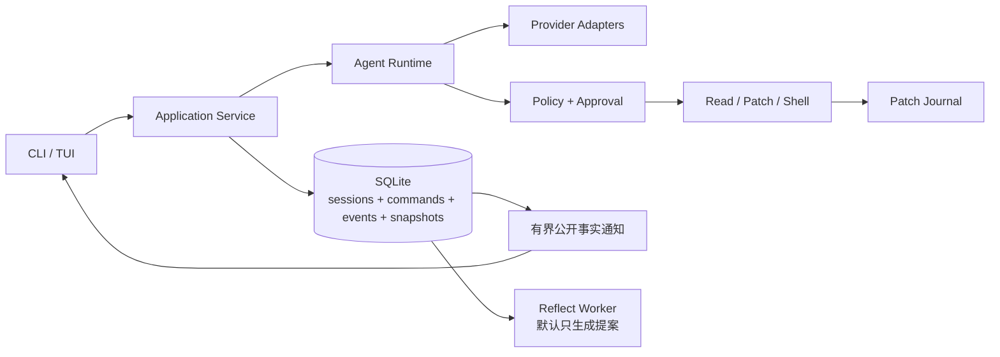

<div align="center">


# MengDie Code / 梦蝶 Code

**不是记得更多，而是记得更对。**

面向国内开发者的本地 Coding Agent：中文优先、记忆可验证、会复盘、兼容国内模型，并重点适配 macOS 与 Windows。

**中文** · [English](./README_EN.md)

[](https://github.com/Scorpio69t/mengdie-code/actions/workflows/ci.yml)
[](./LICENSE)
[](https://go.dev/)
[](./ARCHITECTURE.md)

</div>

> [!IMPORTANT]
> MengDie Code 目前处于架构与基础设施阶段，**还不是可日常使用的 Coding Agent**。仓库公开是为了尽早接受真实需求、设计审查和社区反馈，而不是提前承诺尚未完成的能力。

## 为什么做梦蝶 Code

今天的 Coding Agent 已经会读代码、改文件和运行命令，但日常使用仍有几个反复出现的问题：

- 每次回到项目，都要重新说明测试命令、代码规范和已经否决的方案；
- 长任务经过上下文压缩后，容易忘记目标、约束和失败原因；
- Agent 记住了错误信息时，用户很难知道“它为什么这样认为”；
- 修改失败后，撤销操作容易污染 Git 历史或覆盖用户后续编辑；
- 国内模型、网络环境，以及大量使用 MacBook 或 Windows 的国内开发者，经常不是现有工具组合考虑的首要对象。

MengDie Code 不以“再做一个会调用工具的 CLI”为目标。我们希望构建一个**记忆有来源、结论有证据、修改可回滚、复盘需审核**的本地 Coding Agent。

## 核心方向

### 可信记忆

每条记忆都有来源、作用域、权威等级和有效期。被召回不等于被证实；错误记忆可以追踪、纠正、失效和删除。

计划提供：

```text
mengdie memory list
mengdie memory show <id>
mengdie memory why <id>
mengdie memory remember "..."
mengdie memory forget <id>
```

### 证据驱动复盘

梦蝶的“做梦”在工程内部称为 `reflect/consolidation`：从成功、失败和用户纠正中生成可审核提案。首版不会在无人值守时自动修改代码、AGENTS.md 或正式规则。

### 国内模型与 macOS / Windows 友好

- 中文文档与中文产品体验优先；
- DeepSeek、Kimi、智谱等 OpenAI-compatible 端点优先适配；
- Go 单二进制分发；
- macOS 与 Windows 都是一等平台：MacBook 重视原生终端、zsh、Homebrew 与 Keychain 体验，Windows 重视 Windows Terminal、PowerShell、路径与进程安全；
- Linux 保持完整构建和 CLI 支持，但首轮产品体验优化聚焦 macOS 与 Windows；
- 如实展示当前执行安全等级，不把“受控执行”包装成不存在的强沙箱。

## 中文优先，不排斥英文

这是一个中文优先的开源项目：

- README、设计讨论、Issue 模板和维护者公告默认使用中文；
- 英文读者可以从 [English README](./README_EN.md) 开始；
- 英文 Issue 和 Pull Request 同样欢迎，不要求贡献者会中文；
- 重要稳定文档会逐步提供英文版本，但中文版本是首要维护源。

我们希望中文开发者可以直接参与一个不需要先切换语言的开源 Coding Agent，同时保持对全球社区开放。

## 当前进度

- [x] 产品定位与 v0.2 架构蓝图
- [x] 中文优先的开源仓库基础设施
- [x] 第一阶段 Slice 01：5 个 Coding baseline、配置与 App 骨架
- [x] 第一阶段 Slice 02：版本化事件协议、终端/JSON Lines 输出与 Ctrl+C 状态机
- [x] 第一阶段 Slice 03：OpenAI-compatible HTTP/SSE、工具调用组装与有限重试（[协议说明](./docs/development/phase-1-slice-03/PROVIDER_PROTOCOL.md)）
- [x] 第一阶段 Slice 04：PathGuard 项目边界、Windows 路径语义与 Tool Prepare/Execute 基础协议
- [x] 第一阶段 Slice 05：read_file / list_files / search_text 只读工具（rg fallback、输出限制）
- [x] 第一阶段 Slice 06：确定性 Policy、交互审批与一次性 Capability（[协议说明](./docs/development/phase-1-slice-06/POLICY_PROTOCOL.md)）
- [x] 第一阶段 Slice 07：edit_file / write_file 精确修改、diff 审批、根目录锚定原子写入与 TOCTOU 防护（[协议说明](./docs/development/phase-1-slice-07/EDIT_WRITE_PROTOCOL.md)）
- [x] 第一阶段 Slice 08：zsh / PowerShell 受控执行、环境过滤、输出限制与进程树取消（[协议说明](./docs/development/phase-1-slice-08/SHELL_PROTOCOL.md)）
- [x] 第一阶段 Slice 09：单 Agent Runtime、上下文构建、run-scoped todo 与重复调用保护（[协议说明](./docs/development/phase-1-slice-09/AGENT_RUNTIME_PROTOCOL.md)）
- [x] 第一阶段 Slice 10：结构化 Doctor、DeepSeek/Kimi 当前配置与受保护的真实 Provider smoke（[说明](./docs/development/phase-1-slice-10/DOCTOR_AND_SMOKE.md)）
- [x] 第一阶段 Slice 11A：单次交互任务、终端审批闭环与非 TTY fail-closed（[协议说明](./docs/development/phase-1-slice-11a/INTERACTIVE_RUNTIME.md)）
- [x] 第一阶段 Slice 11B：三平台原生 smoke、四目标 unsigned 开发预览与 SHA-256（[预览说明](./docs/development/phase-1-slice-11b/DEVELOPMENT_PREVIEW.md)）
- [x] 第一阶段 Slice 12：macOS/Windows 受保护的真实 Provider Coding 预验收（[验收说明](./docs/development/phase-1-slice-12/M1_EXIT_EVALUATION.md)，DeepSeek 双平台 10/10 已通过）
- [x] 第二阶段 Slice 02：SQLite EventStore、迁移账本与“先提交、再输出”的最小持久化闭环（[实施报告](./docs/development/phase-2-slice-02/IMPLEMENTATION_REPORT.md)）
- [x] 第二阶段 Slice 03A：Command Ledger、纯 Reducer/Snapshot 与会话 list/show/delete（[实施报告](./docs/development/phase-2-slice-03a/IMPLEMENTATION_REPORT.md)）
- [x] 第二阶段 Slice 03B1：私有上下文日志与安全 Session Resume（[实施报告](./docs/development/phase-2-slice-03b1/IMPLEMENTATION_REPORT.md)）
- [x] 第二阶段 Slice 03B2：中断审批重新确认与执行中只读工具重试（[实施报告](./docs/development/phase-2-slice-03b2/IMPLEMENTATION_REPORT.md)）
- [x] 第二阶段 Slice 04A：只读 Session TUI（[实施报告](./docs/development/phase-2-slice-04a/IMPLEMENTATION_REPORT.md)）
- [x] 第二阶段 Slice 04B：已提交公开事实订阅、缺口补读与 TUI 回放适配（[实施报告](./docs/development/phase-2-slice-04b/IMPLEMENTATION_REPORT.md)）
- [x] 第二阶段 Slice 04C：裸命令默认全屏 TUI、任务提交、实时事实与交互审批闭环（[实施报告](./docs/development/phase-2-slice-04c/IMPLEMENTATION_REPORT.md)）
- [x] 第二阶段 Slice 05A：受控 Artifact Store 与大上下文离线恢复（[实施报告](./docs/development/phase-2-slice-05a/IMPLEMENTATION_REPORT.md)）
- [x] 第二阶段 Slice 05B：可恢复 token 预算与可验证滚动摘要（[实施报告](./docs/development/phase-2-slice-05b/IMPLEMENTATION_REPORT.md)）
- [x] 第二阶段 Slice 05C：滚动摘要来源受控按需回填（[实施报告](./docs/development/phase-2-slice-05c/IMPLEMENTATION_REPORT.md)）
- [x] 第二阶段 Slice 06A：Patch Journal 写入事实与崩溃判定（[实施报告](./docs/development/phase-2-slice-06a/IMPLEMENTATION_REPORT.md)）
- [x] 第二阶段 Slice 06B：回滚材料、显式审批与安全 rewind（[实施报告](./docs/development/phase-2-slice-06b/IMPLEMENTATION_REPORT.md)）
- [x] 第二阶段 Slice 07：项目指令与最小 Skill 按需加载（[实施报告](./docs/development/phase-2-slice-07/IMPLEMENTATION_REPORT.md)）
- [x] 第二阶段 Slice 08A：可恢复用量事实与版本化成本估算（[实施报告](./docs/development/phase-2-slice-08a/IMPLEMENTATION_REPORT.md)）
- [x] 第二阶段 Slice 08B：随机故障注入与 M2 退出评测（[实施报告](./docs/development/phase-2-slice-08b/IMPLEMENTATION_REPORT.md)、[M2 退出矩阵](./docs/development/phase-2-slice-08b/M2_EXIT_MATRIX.md)）
- [ ] M0：真实 Coding、长任务与记忆可信度评测集
- [ ] M1：可完成真实任务的最小 Agent Runtime（[第一阶段详细设计](./docs/design/phase-1/DETAILED_DESIGN.md)）
- [ ] M2：事件持久化、恢复、上下文压缩与 Patch Journal（[第二阶段详细设计](./docs/design/phase-2/DETAILED_DESIGN.md)）
- [x] 第三阶段 Slice 01：可信记忆 schema + FTS5 + 显式 CLI + Agent 集成（[设计稿](./docs/superpowers/specs/2026-08-24-m3-slice-01-trusted-memory-design.md)、[实施报告](./docs/development/phase-3-slice-01/IMPLEMENTATION_REPORT.md)）
- [x] 第三阶段 Slice 02：MemoryExtractor 自动候选提取 + memory_recall 工具注册（[设计稿](./docs/superpowers/specs/2026-08-24-m3-slice-02-extractor-design.md)、[实施报告](./docs/development/phase-3-slice-02/IMPLEMENTATION_REPORT.md)）
- [x] M3 Slice 03：ruleGoTest/ruleGoLint schema 修复 + fingerprint auto-Approve（[设计稿](./docs/superpowers/specs/2026-08-24-m3-slice-03-auto-approve-design.md)）
- [x] M3 Slice 04：跨 Authority dispute 标记 + fingerprint auto-Approve 守门（[设计稿](./docs/superpowers/specs/2026-08-24-m3-slice-04-cross-authority-dispute-design.md)、[实施报告](./docs/development/phase-3-slice-04/IMPLEMENTATION_REPORT.md)）
- [x] M4 Slice 01：Reflect/Consolidate v0.1 手动复盘提案（[设计稿](./docs/superpowers/specs/2026-08-26-m4-slice-01-reflect-proposal-design.md)、[实施报告](./docs/development/phase-4-slice-01/IMPLEMENTATION_REPORT.md)）

完整产品架构见 [ARCHITECTURE.md](./ARCHITECTURE.md)；M1 实施基线见 [第一阶段详细设计](./docs/design/phase-1/DETAILED_DESIGN.md)。`mengdie` 与 `mengdie exec` 已接入同一套最小 Agent Runtime 和安全工具链；多平台开发预览、连续 20 次 main CI 以及 DeepSeek 在 macOS/Windows 的双平台 10/10 Coding 预验收均已形成证据。外部真实仓库任务与安全出口记录未齐前，M1 仍不标记完成。

工程依赖的选择、升级和供应链标准见 [依赖与现代化工程准则](./docs/DEPENDENCIES.md)，Logo 与 CLI 启动体验见 [品牌规范](./docs/BRAND.md)。

## 架构概览



v0.1 坚持单进程、本地优先。daemon、Web、异步 Swarm、向量检索和记忆图谱只有在真实数据证明必要后才进入开发范围。

## 本地查看

当前源码预览已经包含 CLI/App 骨架、分层配置、结构化 Doctor、5 个可重复 Coding baseline、Provider 协议、安全工具链、最小 Agent Runtime、SQLite 事件持久化和默认全屏 TUI。配置 Provider 后，裸命令进入单次 TUI 任务，`exec` 用于无头自动化；需要排障或兼容简易终端时可显式使用 `--plain`：

```bash
git clone https://github.com/Scorpio69t/mengdie-code.git
cd mengdie-code
go test ./...
go run ./cmd/mengdie --version
go run ./cmd/mengdie doctor --offline --json
go run ./cmd/mengdie doctor
go run ./cmd/mengdie
go run ./cmd/mengdie --plain
go run ./cmd/mengdie exec --json "检查当前项目"
go run ./cmd/mengdie exec --json --command-id ci-job-42 "检查当前项目"
go run ./cmd/mengdie exec --allow-edit --allow-command go,test "修复失败测试"
go run ./cmd/mengdie session list
go run ./cmd/mengdie session show --json <session-id>
go run ./cmd/mengdie session tui <session-id>
go run ./cmd/mengdie session resume --message "继续检查" <session-id>
go run ./cmd/mengdie rewind <session-id>
go run ./cmd/mengdie rewind --journal-id <journal-id> <session-id>
go run ./cmd/mengdie session delete --yes <session-id>
go run ./cmd/mengdie-eval --manifest evals/coding/smoke.json --pretty
```

交互入口每次启动只接收一个不超过 64 KiB 的任务。裸命令默认打开全屏 TUI，显示 Logo、项目、模型与安全等级，可提交多行任务、查看已提交事实时间线，并对当前精确工具调用执行允许、拒绝或编辑后重备；审批选择本身不会签发 Capability，授权仍由 Policy Authorizer 完成。`Ctrl+C` 或运行中的 `q` 会先取消 Agent 并等待 Runtime 写入确定终态。`run.started`、完成消息、警告和 Run 终态等可重建边界已持久化到本地 SQLite，流式 `message.delta` 仍只存在内存中。事实先提交再输出，因此输出器失败不会抹掉已提交事件；存储失败则不会把事件伪装成已发生。已提交公开事实随后进入同进程有界通知总线；慢消费者会收到缺口标记，并通过 `afterSeq` 从 EventStore 补读，TUI 不会成为第二事实源。`session list/show/resume/delete` 通过 Session Service 工作，Snapshot 只作可丢弃缓存；`delete` 必须显式提供 `--yes`。`session resume` 在同一 Session 创建新 Run，恢复完整 user/assistant/只读工具边界和 Todo；写入、执行、网络工具只恢复脱敏摘要。中断在待审批时，只能在交互终端按当前项目状态重新 Prepare、查看新预览并重新确认，旧 Capability 永不复用；执行中的 read/state 也只能由用户显式确认后重试。`edit_file` 与 `write_file` 会在任何项目文件副作用之前提交 Patch Journal 写入意图和私有回滚材料，原子替换后再校验写后哈希与权限位；若中断，resume 只按当前文件严格落入“未写入、已写入、冲突”三态。交互命令 `mengdie rewind <session-id>` 默认选择最近一个可回滚 Journal，也可用 `--journal-id` 精确指定；它重新校验项目、路径、写后内容和权限位，展示单文件反向 diff，强制显式审批并消费新的单次 Capability。写后又被用户修改或 chmod 时一律拒绝，不覆盖后续工作；进程中断后只按严格写前/写后/冲突三态补记 Command 与 Journal，绝不重放文件副作用。execute/network 状态未知、多个未完成调用、旧版无上下文日志或私有/公开事实不一致时仍一律中文拒绝。`session tui` 继续提供历史会话的只读查看；同一 TUI 内连续提交多轮任务与 REPL 尚未实现，管道或重定向场景必须改用 `mengdie exec`。

默认数据目录为 macOS 的 `~/Library/Application Support/MengDie Code/`、Windows 的 `%LOCALAPPDATA%\MengDie Code\`，Linux 使用 `$XDG_STATE_HOME/mengdie/`（未设置时为 `~/.local/state/mengdie/`）。可通过 `MENGDIE_DATA_DIR` 覆盖，但仓库内、网络共享、OneDrive/iCloud 同步目录以及 symlink/reparse point 会被拒绝。

`exec --json` 输出完整 JSON Lines 运行事件。`--command-id` 可为自动化提供幂等键：同 ID、同任务只回放已经提交的公开事实，不再调用 Provider 或工具；同 ID、不同任务直接冲突，运行中或中断状态不会由 `exec` 自动续跑，需要显式通过安全门禁调用 `session resume`。恢复命令也支持独立的 `--command-id`，重复 ID 只回放该恢复 Run 的公开事实。无头模式默认拒绝 edit/write/shell；`--allow-edit` 只放行项目内修改，`--allow-command go,test` 只放行无控制操作符的 `go test` 命令前缀，`--allow-env NAME` 才允许 shell 继承对应敏感环境变量。

项目指令按“用户配置目录下的 `AGENTS.md` → 项目根 `AGENTS.md` → 当前工作目录最近层级”依次进入上下文。最小 Skill 从用户级 `~/.mengdie/skills/<name>/SKILL.md` 和项目级 `.mengdie/skills/<name>/SKILL.md` 发现；同名时项目级胜出并由 `doctor` 报告冲突。Runtime 常驻的只有名称、单行 description 和逻辑来源，模型确有需要时才通过只读 `read_skill` 加载受快照哈希约束的全文。Skill 内容只是指令，不授予文件、命令、网络或其他工具权限，也不会触发联网安装。

公开事件、`session` 输出和日志不包含完整用户任务、密钥或隐藏推理。为进行 Command 幂等与上下文恢复，完整任务和模型可见消息会作为私有事实保存；超过 64 KiB 的单条上下文或回滚前镜像改存到数据目录下受控的 `artifacts/`，SQLite 只登记相对路径、大小和 SHA-256，恢复时必须重新校验；较小回滚前镜像作为私有 BLOB 保存，二者都不会进入 EventBus、TUI 或 JSONL。默认配额为每个 Session 128 MiB、全局 512 MiB，超限拒绝新 Artifact，不静默删除仍在使用的数据。模型请求超过 token 预算时，Runtime 会保留首个原始任务、当前任务、Todo、项目/安全指令和最近完整消息，只把中间闭合区间交给同一 Provider 的无工具请求生成滚动摘要；摘要单独保存来源 ordinal、生成模型、协议版本与 SHA-256，原始上下文不被改写。恢复会先校验完整原始事实，再复用有效摘要和原始尾部；摘要损坏时 fail-closed。模型若需要摘要中的精确原文，只能调用 `read_context_source` 按相对偏移有界回查当前 Session 的最新有效摘要区间；工具不接受 Session ID 或路径，Prepare/Execute 两次核对摘要哈希与区间，大消息按字节续读，摘要轮换、原始消息或 Artifact 损坏都会拒绝。回填正文仅进入私有模型上下文，TUI/JSONL 只看到工具名、区间等元数据。副作用工具只允许恢复安全摘要进入压缩与回填来源，避免派生上下文越过持久化边界。API Key、允许继承的环境变量值和可重放审批授权不会写入。私有事实当前仅依赖目录/文件权限，尚未静态加密；不要把 `MENGDIE_DATA_DIR` 指向共享或同步目录，并使用 `session delete --yes` 删除不再需要的本地会话及所属 Artifact。

需要 Go 1.26 或更高版本。

`doctor --offline` 只做本地检查且不构造 Provider；默认 `doctor` 会用固定、无源码内容的工具调用执行一次有限在线探测。输出中的项目路径和用户配置路径会被逻辑占位符替代，密钥只检查是否存在，永不显示值。完整契约和退出码见 [Doctor 与 Provider smoke 说明](./docs/development/phase-1-slice-10/DOCTOR_AND_SMOKE.md)。

GitHub Actions 会生成 macOS Apple Silicon/Intel、Windows x64 和 Linux x64 的 7 天 unsigned 开发预览，附带 SHA-256 与构建元数据。它们不是正式 Release，安装前请阅读[开发预览下载、校验与平台限制](./docs/development/phase-1-slice-11b/DEVELOPMENT_PREVIEW.md)。

国内模型的无密钥配置样例见[组合示例](./configs/examples/config.toml)、[DeepSeek 示例](./configs/examples/deepseek.toml)、[Kimi Code 会员示例](./configs/examples/kimi-code.toml)和 [Kimi 开放平台示例](./configs/examples/kimi-platform.toml)。Kimi Code 与开放平台的 Key、端点和额度互不通用，必须选择对应 profile；模型名与端点会随 Provider 调整，示例记录了核验日期，使用前应以官方文档为准。用户配置使用 `os.UserConfigDir()` 对应的平台目录，项目配置放在 `.mengdie/config.toml`；密钥只通过样例中的环境变量名引用，不得写入项目文件。

## 参与贡献

目前最有价值的贡献不是堆功能，而是：

- 提供你真实使用 Coding Agent 时最痛的场景；
- 审核 [架构设计](./ARCHITECTURE.md) 中不合理或过度设计的部分；
- 帮助建立可重复的真实任务与记忆评测；
- 讨论国内 Provider、macOS / Windows 的执行边界、分发安装与终端体验；
- 修正文档、补充测试或实现当前里程碑中的小闭环。

开始前请阅读 [贡献指南](./CONTRIBUTING.md) 和 [行为准则](./CODE_OF_CONDUCT.md)。安全问题请不要公开披露，参见 [安全策略](./SECURITY.md)。

## 名字的由来

“梦蝶”来自《庄子·齐物论》中的庄周梦蝶。对 MengDie Code 来说：清醒时与你协作编码，空闲时复盘经历；但每一次“成长”都必须留下证据，并接受人的审核。

## 开源协议

MengDie Code 使用 [Apache License 2.0](./LICENSE) 开源。
