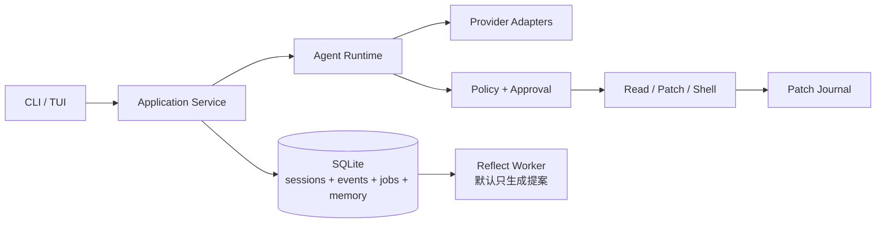

<div align="center">


# MengDie Code / 梦蝶 Code

**不是记得更多，而是记得更对。**

面向国内开发者的本地 Coding Agent：中文优先、记忆可验证、会复盘、兼容国内模型，并重点适配 macOS 与 Windows。

**中文** · [English](./README_EN.md)

[](https://github.com/Scorpio69t/mengdie-code/actions/workflows/ci.yml)
[](./LICENSE)
[](https://go.dev/)
[](./ARCHITECTURE.md)

</div>

> [!IMPORTANT]
> MengDie Code 目前处于架构与基础设施阶段，**还不是可日常使用的 Coding Agent**。仓库公开是为了尽早接受真实需求、设计审查和社区反馈，而不是提前承诺尚未完成的能力。

## 为什么做梦蝶 Code

今天的 Coding Agent 已经会读代码、改文件和运行命令，但日常使用仍有几个反复出现的问题：

- 每次回到项目，都要重新说明测试命令、代码规范和已经否决的方案；
- 长任务经过上下文压缩后，容易忘记目标、约束和失败原因；
- Agent 记住了错误信息时，用户很难知道“它为什么这样认为”；
- 修改失败后，撤销操作容易污染 Git 历史或覆盖用户后续编辑；
- 国内模型、网络环境，以及大量使用 MacBook 或 Windows 的国内开发者，经常不是现有工具组合考虑的首要对象。

MengDie Code 不以“再做一个会调用工具的 CLI”为目标。我们希望构建一个**记忆有来源、结论有证据、修改可回滚、复盘需审核**的本地 Coding Agent。

## 核心方向

### 可信记忆

每条记忆都有来源、作用域、权威等级和有效期。被召回不等于被证实；错误记忆可以追踪、纠正、失效和删除。

计划提供：

```text
mengdie memory list
mengdie memory show <id>
mengdie memory why <id>
mengdie memory remember "..."
mengdie memory forget <id>
```

### 证据驱动复盘

梦蝶的“做梦”在工程内部称为 `reflect/consolidation`：从成功、失败和用户纠正中生成可审核提案。首版不会在无人值守时自动修改代码、AGENTS.md 或正式规则。

### 国内模型与 macOS / Windows 友好

- 中文文档与中文产品体验优先；
- DeepSeek、Kimi、智谱等 OpenAI-compatible 端点优先适配；
- Go 单二进制分发；
- macOS 与 Windows 都是一等平台：MacBook 重视原生终端、zsh、Homebrew 与 Keychain 体验，Windows 重视 Windows Terminal、PowerShell、路径与进程安全；
- Linux 保持完整构建和 CLI 支持，但首轮产品体验优化聚焦 macOS 与 Windows；
- 如实展示当前执行安全等级，不把“受控执行”包装成不存在的强沙箱。

## 中文优先，不排斥英文

这是一个中文优先的开源项目：

- README、设计讨论、Issue 模板和维护者公告默认使用中文；
- 英文读者可以从 [English README](./README_EN.md) 开始；
- 英文 Issue 和 Pull Request 同样欢迎，不要求贡献者会中文；
- 重要稳定文档会逐步提供英文版本，但中文版本是首要维护源。

我们希望中文开发者可以直接参与一个不需要先切换语言的开源 Coding Agent，同时保持对全球社区开放。

## 当前进度

- [x] 产品定位与 v0.2 架构蓝图
- [x] 中文优先的开源仓库基础设施
- [x] 第一阶段 Slice 01：5 个 Coding baseline、配置与 App 骨架
- [x] 第一阶段 Slice 02：版本化事件协议、终端/JSON Lines 输出与 Ctrl+C 状态机
- [x] 第一阶段 Slice 03：OpenAI-compatible HTTP/SSE、工具调用组装与有限重试（[协议说明](./docs/development/phase-1-slice-03/PROVIDER_PROTOCOL.md)）
- [ ] M0：真实 Coding、长任务与记忆可信度评测集
- [ ] M1：可完成真实任务的最小 Agent Runtime（[第一阶段详细设计](./docs/design/phase-1/DETAILED_DESIGN.md)）
- [ ] M2：事件持久化、恢复、上下文压缩与 Patch Journal
- [ ] M3：可审计的可信记忆
- [ ] M4：默认只生成提案的复盘机制

完整产品架构见 [ARCHITECTURE.md](./ARCHITECTURE.md)；M1 实施基线见 [第一阶段详细设计](./docs/design/phase-1/DETAILED_DESIGN.md)。当前 Provider 已完成离线协议层，尚未接入 `mengdie exec`；真实模型 smoke 与 CLI 闭环仍在后续工作包中。

工程依赖的选择、升级和供应链标准见 [依赖与现代化工程准则](./docs/DEPENDENCIES.md)，Logo 与 CLI 启动体验见 [品牌规范](./docs/BRAND.md)。

## 架构概览



v0.1 坚持单进程、本地优先。daemon、Web、异步 Swarm、向量检索和记忆图谱只有在真实数据证明必要后才进入开发范围。

## 本地查看

当前开发预览已经包含 CLI/App 骨架、分层配置、最小 doctor、5 个可重复 Coding baseline，以及供后续 Runtime 共用的事件与终端输出边界，但还不包含 Agent Runtime：

```bash
git clone https://github.com/Scorpio69t/mengdie-code.git
cd mengdie-code
go test ./...
go run ./cmd/mengdie --version
go run ./cmd/mengdie doctor --json
go run ./cmd/mengdie exec --json "检查当前项目"
go run ./cmd/mengdie-eval --manifest evals/coding/smoke.json --pretty
```

`exec --json` 当前会输出 `run.started` 与 `run.failed` 两条 JSON Lines 事件，并以退出码 1 结束，用于验证管道协议；它不会假装已经执行任务。事件只包含运行所需的公开元数据，不写入完整用户任务、密钥或隐藏推理。人类输出走 stderr，JSON Lines 走 stdout，便于稳定接入脚本。

需要 Go 1.26 或更高版本。

国内模型的无密钥配置样例见 [`configs/examples/config.toml`](./configs/examples/config.toml)。用户配置使用 `os.UserConfigDir()` 对应的平台目录，项目配置放在 `.mengdie/config.toml`；密钥只通过样例中的环境变量名引用，不得写入项目文件。

## 参与贡献

目前最有价值的贡献不是堆功能，而是：

- 提供你真实使用 Coding Agent 时最痛的场景；
- 审核 [架构设计](./ARCHITECTURE.md) 中不合理或过度设计的部分；
- 帮助建立可重复的真实任务与记忆评测；
- 讨论国内 Provider、macOS / Windows 的执行边界、分发安装与终端体验；
- 修正文档、补充测试或实现当前里程碑中的小闭环。

开始前请阅读 [贡献指南](./CONTRIBUTING.md) 和 [行为准则](./CODE_OF_CONDUCT.md)。安全问题请不要公开披露，参见 [安全策略](./SECURITY.md)。

## 名字的由来

“梦蝶”来自《庄子·齐物论》中的庄周梦蝶。对 MengDie Code 来说：清醒时与你协作编码，空闲时复盘经历；但每一次“成长”都必须留下证据，并接受人的审核。

## 开源协议

MengDie Code 使用 [Apache License 2.0](./LICENSE) 开源。
