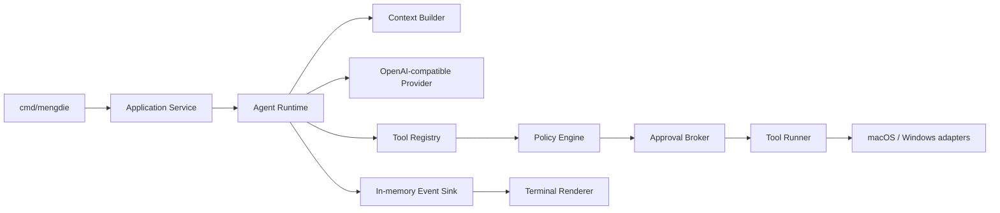
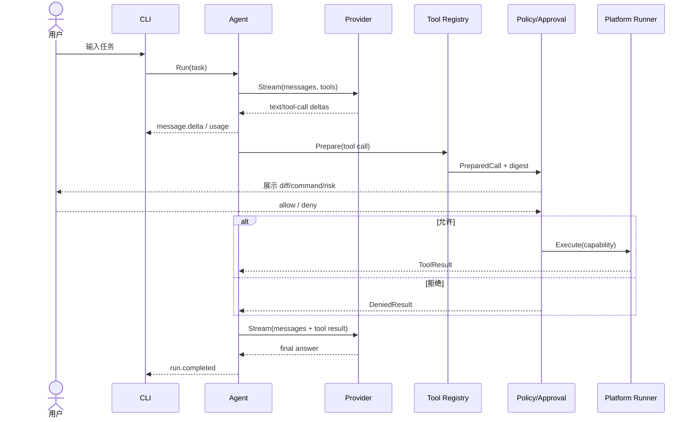

# MengDie Code 第一阶段详细设计

> 阶段：M1 · 能日用  
> 状态：已审核，实施中
> 版本：v0.1  
> 日期：2026-07-30  
> 目标平台：macOS 与 Windows（Tier 1），Linux（Tier 2）

---

## 1. 结论摘要

第一阶段只解决一个问题：

> **让开发者可以在一个真实 Git 仓库中，把“理解问题 → 修改文件 → 运行验证 → 得到可审核结果”的最小闭环交给 MengDie Code。**

这一阶段不实现记忆、复盘、daemon、Web、resume、MCP 或子 Agent。它们都依赖一个可靠的单 Agent 执行内核；如果最小内核不能在 macOS 与 Windows 上稳定完成真实任务，再完整的记忆系统也没有产品价值。

第一阶段采用以下关键决策：

1. 单进程、本地优先，不启动后台服务。
2. OpenAI-compatible `/chat/completions` + SSE 是首个 Provider 协议。
3. 使用简单终端交互层，不引入完整 TUI 框架。
4. 工具调用分为 Prepare 与 Execute；所有副作用必须经过 Policy 与 Approval。
5. 文件修改首版使用确定性的 exact-edit，而不是自行实现完整 unified diff 应用器。
6. shell 默认逐次审批；无头模式默认禁用 shell。
7. macOS 与 Windows 是双 Tier 1 平台，平台差异通过 `internal/platform` 隔离。
8. M1 事件只在内存中流转，但事件结构必须可以在 M2 直接进入 EventStore。

依赖与编码风格遵循 [`docs/DEPENDENCIES.md`](../../DEPENDENCIES.md)：优先使用现代 Go 标准库；确需第三方组件时，以社区采用度、持续维护、跨平台证据、许可证和供应链成本共同准入，不以“少依赖”或 Star 数作为单一目标。

---

## 2. 阶段边界

### 2.1 进入条件

M0 至少完成以下基线后，M1 才进入正式编码：

- `evals/coding/` 中有不少于 20 个真实任务定义；
- 至少 5 个任务具备可自动判断的验收脚本；
- 记录一个现有 Coding CLI 在同一任务上的基线结果；
- 明确任务成功、无关 diff、人工介入和副作用四类指标；
- 确定 macOS 与 Windows 各一套可重复运行的开发环境。

进入条件不是要求评测系统已经完美，而是防止开发过程只靠主观演示判断质量。

### 2.2 M1 必须交付

- `mengdie` 交互模式；
- `mengdie exec "任务"` 无头模式；
- `mengdie doctor` 环境自检；
- OpenAI-compatible 流式模型调用与工具调用；
- `read_file`、`list_files`、`search_text`、`edit_file`、`write_file`、`shell`、`write_todos`；
- Agent plan → model → tool → observe 循环；
- macOS 与 Windows 的路径、Shell、进程树和终端适配；
- read/write/execute/network 风险分类；
- 交互审批、拒绝与取消；
- AGENTS.md 加载；
- token 用量、模型错误和工具结果展示；
- 单元、契约、集成、平台 smoke test；
- macOS 与 Windows 的开发预览二进制。

### 2.3 M1 明确不交付

- SQLite EventStore、session resume 和历史会话；
- Artifact Store、自动上下文压缩；
- Patch Journal 与跨回合 rewind；
- 可信记忆、`memory` 命令和 `reflect`；
- daemon、Web、ACP、MCP 和插件；
- 子 Agent、worktree 协调和并行写入；
- 完整 Bubble Tea TUI；
- 自动 Git commit；
- OS 级强沙箱承诺；
- 自动更新、Homebrew/Winget 正式发布渠道、代码签名和 macOS notarization。

这些能力可以预留边界，但不能为了“未来可能需要”提前写空框架。

---

## 3. 用户闭环与验收场景

### 3.1 交互修复

```text
$ mengdie
MengDie Code · deepseek:deepseek-v4-flash · 受控本地执行

> 修复当前失败的单元测试，不要引入新依赖

计划
  1. [进行中] 读取失败测试和相关实现
  2. [待处理] 修改实现
  3. [待处理] 运行目标测试

读取  tests/parser_test.go
读取  internal/parser/parser.go

准备修改 internal/parser/parser.go
  ... diff preview ...
允许本次修改？ [y]es / [n]o / [a]ll edits: y

准备执行 go test ./internal/parser
允许执行？ [y]es / [n]o: y

✓ 测试通过
```

验收标准：

- 未批准前文件哈希不变；
- diff 与实际修改一致；
- shell 执行目录、命令和风险等级可见；
- 拒绝操作后，拒绝结果会返回模型，模型不得假装已经执行；
- 任务结束时给出修改文件与验证结果摘要。

### 3.2 无头任务

```bash
mengdie exec --model deepseek-v4-flash "解释 internal/auth 的鉴权流程"
```

默认规则：

- 允许只读工具；
- 禁止 edit/write/shell/network；
- 如模型请求副作用工具，进程以明确错误退出；
- 只有显式 `--allow-edit` 或 `--allow-command go,test` 才能放行对应能力；
- stdout 输出最终文本，结构化事件可选输出到 stderr 或 JSON Lines。

### 3.3 中断

- 第一次 `Ctrl+C` 取消当前模型调用或工具进程，保留 CLI；
- 2 秒内第二次 `Ctrl+C` 退出进程；
- macOS 必须终止整个进程组；
- Windows 必须关闭 Job Object 中的进程树；
- 取消事件明确区分 user_cancelled、timeout 与 provider_error。

### 3.4 第一阶段出口验收

M1 只有同时满足以下条件才算完成：

1. 在 macOS 与 Windows 上各完成至少 5 个真实仓库任务；
2. 至少 3 个任务包含“读 → 改 → 测 → 修正”的完整循环；
3. 未授权文件写入和命令执行次数为 0；
4. 取消后无遗留子进程；
5. Provider 流中断、429、5xx、非法 tool args 都有确定行为；
6. macOS 与 Windows CI 连续 20 次无平台相关偶发失败；
7. `go test ./...`、`go vet ./...` 与格式检查通过；
8. README 不再把占位命令描述成可用 Agent，并提供开发预览说明。

---

## 4. M1 总体架构



### 4.1 数据流



### 4.2 包结构

```text
cmd/mengdie/
  main.go                 # 只做启动与退出码

internal/app/
  app.go                  # command dispatch、依赖装配
  interactive.go
  exec.go
  doctor.go

internal/agent/
  runtime.go              # 核心循环
  state.go                # 本次 run 的内存状态
  planner.go              # todo 状态
  errors.go

internal/context/
  builder.go              # system + AGENTS + history + tools
  budget.go               # M1 只做硬限制与近期裁剪

internal/provider/
  provider.go             # 最小接口与统一类型
  openaicompat/
    client.go
    request.go
    stream.go
    errors.go

internal/tools/
  tool.go
  registry.go
  read_file.go
  list_files.go
  search_text.go
  edit_file.go
  write_file.go
  shell.go
  write_todos.go

internal/policy/
  engine.go
  rules.go
  approval.go
  capability.go

internal/platform/
  pathguard.go
  process.go
  terminal.go
  darwin/
    process.go
    shell.go
  windows/
    process.go
    shell.go

internal/project/
  root.go                 # Git root / cwd
  agents.go               # AGENTS.md 加载

internal/config/
  config.go
  load.go
  validate.go

internal/events/
  event.go
  sink.go

internal/ui/terminal/
  renderer.go
  prompt.go
  approval.go

internal/redact/
  redact.go

evals/
  coding/
  fixtures/
```

没有外部消费者前不建立 `pkg/api`。接口由使用方所在包定义，避免出现只有一个实现却层层 interface 的情况。

---

## 5. CLI 设计

### 5.1 命令

```text
mengdie [flags]                    交互模式
mengdie exec <task> [flags]        单任务无头模式
mengdie doctor [--json]            环境与配置自检
mengdie version                    版本、commit、Go 与平台信息
```

M1 使用标准库 `flag.FlagSet` 解析子命令，不引入 Cobra。命令扩展到维护困难时再评估迁移。

### 5.2 通用参数

| 参数 | 含义 | 默认值 |
|---|---|---|
| `--model provider:model` | 本次使用模型 | 配置文件默认模型 |
| `--profile name` | 配置 profile | `default` |
| `--cwd path` | 项目工作目录 | 当前目录 |
| `--approval mode` | `suggest` / `auto-edit` | `suggest` |
| `--max-turns n` | 最大 Agent 回合 | 32 |
| `--timeout duration` | 单次模型/工具操作超时 | 类型相关默认值 |
| `--debug` | 输出脱敏诊断日志 | false |
| `--json` | JSON Lines 事件输出，仅 exec/doctor | false |

不提供一个模糊的 `--dangerously-skip-all`。如果未来提供全自动模式，也必须保留确定性路径边界和硬拒绝规则。

### 5.3 退出码

| 退出码 | 含义 |
|---|---|
| 0 | 成功 |
| 1 | 任务未完成或普通运行错误 |
| 2 | 参数/配置错误 |
| 3 | Provider 认证或协议错误 |
| 4 | Policy 拒绝或无头模式缺少授权 |
| 5 | 用户取消 |
| 6 | 工具或验证失败且无法恢复 |

---

## 6. 配置设计

### 6.1 路径

使用 `os.UserConfigDir()`，不手写平台路径：

| 平台 | 用户配置目录示例 |
|---|---|
| macOS | `~/Library/Application Support/mengdie/config.toml` |
| Windows | `%AppData%\mengdie\config.toml` |
| Linux | `$XDG_CONFIG_HOME/mengdie/config.toml` 或 `~/.config/mengdie/config.toml` |

项目级 `.mengdie/config.toml` 只能包含非秘密配置。M1 的加载优先级：

```text
CLI flags
  > MENGDIE_* 环境变量
  > 项目 .mengdie/config.toml
  > 用户 config.toml
  > 内置默认值
```

### 6.2 配置示例

```toml
default_profile = "deepseek"

[profiles.deepseek]
provider = "openai-compatible"
base_url = "https://api.deepseek.com"
api_key_env = "DEEPSEEK_API_KEY"
model = "deepseek-v4-flash"
cheap_model = "deepseek-v4-flash"
request_timeout = "120s"
max_context_tokens = 1000000

[profiles.kimi]
provider = "openai-compatible"
base_url = "https://api.moonshot.ai/v1"
api_key_env = "MOONSHOT_API_KEY"
model = "kimi-k3"
max_context_tokens = 1000000

[approval]
mode = "suggest"
read_project_files = true
allow_commands = ["go test", "go vet", "git status", "git diff"]

[context]
max_tool_output_bytes = 65536
max_turns = 32
```

### 6.3 秘密

- M1 不允许把 API key 直接写入项目配置；
- 用户配置即使出现 `api_key` 字段也拒绝加载，并提示使用环境变量；
- debug 日志对 Authorization、Cookie、常见 token 格式和配置值脱敏；
- `doctor` 只显示“已设置/未设置”，永远不回显密钥；
- macOS Keychain 与 Windows Credential Manager 集成进入后续小版本，不阻塞 M1，但接口预留为 `CredentialSource` 而不是散落读取环境变量。

---

## 7. Provider 详细设计

### 7.1 接口

```go
type Provider interface {
	Capabilities(ctx context.Context, model string) (Capabilities, error)
	Stream(ctx context.Context, req ChatRequest, sink StreamSink) (*ChatResponse, error)
}

type Capabilities struct {
	ToolCalling      bool
	ParallelTools    bool
	UsageInStream    bool
	StrictToolSchema bool
	MaxContextTokens int
}

type StreamSink interface {
	OnEvent(ctx context.Context, event StreamEvent) error
}
```

`StreamSink` 返回错误时 Provider 必须立即取消 HTTP body 读取，使 UI 错误或用户取消可以向上传播。

### 7.2 OpenAI-compatible 协议范围

M1 支持：

- `POST /chat/completions`；
- `stream=true` 的 SSE；
- text delta；
- tool call id/name/arguments 分片；
- finish reason；
- usage（供应商提供时）；
- 标准 401、403、408、429、5xx 错误；
- 自定义 base URL 与附加静态 header（禁止在项目配置写秘密值）。

M1 不假设所有端点都支持：

- `stream_options.include_usage`；
- parallel tool calls；
- strict JSON schema；
- reasoning/thinking stream；
- prompt cache 明细；
- Responses API。

这些差异由 capability 配置或启动 probe 明确，而不是运行中猜测。

### 7.3 SSE 解析

- 使用 `bufio.Reader`，不使用默认 64 KiB 上限的 `bufio.Scanner`；
- 支持 CRLF/LF、注释行、多 `data:` 行和 `[DONE]`；
- 单事件设置硬上限，默认 2 MiB；
- tool arguments 按 call index/id 累积，完成后再做 JSON 校验；
- 非法 JSON、缺失 tool name、重复 call id 都返回协议错误；
- 读取结束但没有 finish reason 时标记 `unexpected_eof`，不当作成功。

### 7.4 重试

只重试尚未向 Agent 交付任何可见 delta 的请求：

- 网络连接失败、408、429、部分 5xx：指数退避 + jitter，最多 3 次；
- 已经收到 text/tool delta 后断流：不自动重放，避免重复工具意图；
- 401/403、400 schema 错误：不重试；
- 每次重试发事件，用户能看到原因与等待时间。

### 7.5 测试

通过 `httptest.Server` 覆盖：

- 正常文本流；
- 单个和多个 tool call 分片；
- 中文与 Unicode 边界；
- CRLF 与大事件；
- `[DONE]` 前后异常；
- 429 + Retry-After；
- 中途断流；
- 用户取消；
- Authorization 脱敏。

真实 Provider 测试只在手动或受保护 CI 中运行，不让 PR 测试依赖外部网络和付费 API。

---

## 8. Agent Runtime

### 8.1 状态

```go
type RunState struct {
	RunID      string
	Messages   []Message
	Todos      []Todo
	Turn       int
	Usage      Usage
	StartedAt  time.Time
	ToolPolicy PolicySnapshot
}
```

M1 的 RunState 只存在内存中。进程退出即丢失，这是明确限制；M2 再通过 EventStore 恢复。

### 8.2 循环

```go
func (a *Agent) Run(ctx context.Context, req RunRequest, sink events.Sink) error {
	state := newRunState(req)
	state.Messages = append(state.Messages, userMessage(req.Task))

	for state.Turn < req.MaxTurns {
		state.Turn++
		chatReq, err := a.context.Build(state)
		if err != nil {
			return err
		}

		resp, err := a.provider.Stream(ctx, chatReq, sink)
		if err != nil {
			return classifyProviderError(err)
		}
		state.Messages = append(state.Messages, resp.AssistantMessage)

		if len(resp.ToolCalls) == 0 {
			return sink.Emit(ctx, events.RunCompleted(...))
		}

		for _, call := range resp.ToolCalls {
			result := a.executeOne(ctx, state, call, sink)
			state.Messages = append(state.Messages, toolMessage(call.ID, result))
		}
	}

	return ErrMaxTurns
}
```

M1 所有工具调用串行执行。多个纯读取工具的并行化属于同阶段后半优化，不能影响核心闭环验收。

### 8.3 防无限循环

- 默认 `max_turns=32`；
- 连续 3 次完全相同的工具名 + 参数摘要直接停止并提示模型/用户；
- 同一失败结果重复 3 次停止；
- todo 长时间不变化只发警告，不代替模型判断；
- 达到上限时返回结构化错误和当前计划，不输出伪成功总结。

### 8.4 事件

M1 事件使用与总架构兼容的命名：

```text
run.started
message.delta
message.completed
todo.updated
tool.proposed
approval.needed
approval.resolved
tool.started
tool.completed
usage.updated
warning
run.completed
run.failed
run.cancelled
```

事件包含 `RunID`、进程内 `Seq`、时间和版本。M2 只需增加 SessionID、持久化与断线重放，不必重写 UI 事件语义。

---

## 9. 上下文与系统提示词

### 9.1 组装顺序

```text
核心安全与角色提示
  → 工具使用规范
  → 全局 AGENTS.md
  → 仓库根 AGENTS.md
  → cwd 路径链中的 AGENTS.md
  → 当前 todo
  → 当前会话消息
```

### 9.2 AGENTS.md 加载

- 从项目根到 cwd 逐层加载，越近优先级越高；
- 用户级文件使用配置目录下 `AGENTS.md`；
- 单文件默认最大 64 KiB，总量最大 256 KiB；
- 解析后在 `doctor` 中展示实际加载顺序；
- 项目中的 AGENTS.md 是不可信仓库内容，不能授予额外权限；
- 指令冲突时把冲突来源展示给模型，不做静默文本覆盖。

### 9.3 M1 预算

M1 不做模型摘要压缩，但必须有硬边界：

- tool output 默认最多 64 KiB，保留开头和结尾；
- 单文件读取默认 32 KiB，可用行范围继续读取；
- 超预算前优先丢弃已被后续结果覆盖的旧工具输出；
- 不丢弃当前用户任务、todo、审批拒绝和最后一次验证结果；
- 如仍超出模型窗口，停止并清楚提示“需要 M2 压缩能力”，不静默截断关键指令。

---

## 10. 工具系统

### 10.1 Prepare / Execute

```go
type Tool interface {
	Spec() ToolSpec
	Prepare(ctx context.Context, raw json.RawMessage, env PrepareEnv) (*PreparedCall, error)
	Execute(ctx context.Context, call PreparedCall, cap Capability, env ExecEnv) (*ToolResult, error)
}

type PreparedCall struct {
	ID           string
	ToolName     string
	CanonicalArg json.RawMessage
	Effects      []Effect
	Preview      Preview
	Preconditions []Precondition
	Digest       string
}
```

Prepare 不产生外部副作用。Approval 绑定 `Digest`；Execute 前重新检查路径、文件哈希和参数摘要，防止批准后内容被替换。

### 10.2 路径守卫

项目根按以下顺序确定：

1. `--cwd`；
2. 当前目录向上查找 `.git`；
3. 没有 Git 时使用当前目录，并在 UI 提示风险。

路径规则：

- 所有用户/模型路径转换为绝对规范路径；
- 读取或写入前解析 symlink、junction 和 reparse point；
- 新文件解析最近的已存在父目录；
- 最终路径必须仍在项目根内；
- 默认禁止写 `.git`、配置目录、凭据文件和项目根外路径；
- Windows 拒绝设备路径、NT namespace、Alternate Data Streams 和未批准 UNC；
- macOS 不假设文件系统一定大小写不敏感；
- 路径判断使用平台语义，不用简单字符串前缀。

### 10.3 只读工具

#### `read_file`

输入：path、可选 start_line/end_line。  
输出：带行号文本、编码、截断信息与内容 SHA-256。  
规则：二进制文件不直接注入，返回类型和大小。

#### `list_files`

输入：path、glob、max_depth、limit。  
输出：相对项目根的稳定排序路径。  
规则：默认忽略 `.git`、构建目录和配置的 ignore；达到 limit 明确标注。

#### `search_text`

输入：query、path、glob、case_sensitive、limit。  
实现：优先使用系统 `rg`，不可用时退化为纯 Go walker。  
规则：结果按 path + line 排序，限制单行和总输出。

### 10.4 修改工具

#### `edit_file`

输入：

```json
{
  "path": "internal/parser/parser.go",
  "old_text": "return nil",
  "new_text": "return result",
  "expected_replacements": 1
}
```

规则：

- `old_text` 必须精确匹配指定次数，默认 1；
- Prepare 读取原文件、计算新内容、diff、原哈希与新哈希；
- Approval 展示 diff；
- Execute 重新检查原哈希；
- 写入同目录临时文件、同步、保留权限，再原子替换；
- macOS 与 Windows 分别测试替换语义；
- 任何不确定性都失败，不做“尽力匹配”。

#### `write_file`

- 默认只创建不存在的文件；
- 覆盖已有文件必须转为高风险 write，并展示完整 diff；
- 创建父目录属于同一 PreparedCall；
- 禁止一次写入超大或二进制内容。

M1 不提供 delete_file。删除操作留给经严格设计的后续阶段。

### 10.5 `shell`

输入：command、cwd、timeout。  
默认超时：测试/构建 10 分钟，普通命令 2 分钟；由 profile 限制上限。

规则：

- 每次 Prepare 展示完整命令、cwd、超时、允许继承的环境变量名；
- 交互模式默认逐次审批；
- 无头模式默认禁止；
- allowlist 按规范化命令前缀匹配，不做任意 substring；
- 默认移除常见密钥环境变量，需要时由用户显式 `--allow-env`；
- 输出上限 64 KiB，保留头尾、退出码、耗时和截断标记；
- 禁止交互式 stdin，检测到等待输入时超时并提示；
- 进程必须加入可整体终止的平台进程容器。

### 10.6 `write_todos`

状态：`pending → in_progress → completed`，允许 `cancelled`。  
约束：同一时间最多一个 `in_progress`。  
Todo 只存在当前 RunState，不写入仓库文件。

---

## 11. Policy 与 Approval

### 11.1 决策

```go
type Decision string

const (
	Allow Decision = "allow"
	Ask   Decision = "ask"
	Deny  Decision = "deny"
)

type PolicyEngine interface {
	Decide(ctx context.Context, call PreparedCall, state PolicyState) PolicyDecision
}
```

优先级：硬拒绝规则 > CLI 临时授权 > profile 规则 > 工具默认规则。

### 11.2 M1 默认策略

| 操作 | 交互模式 | exec 模式 |
|---|---|---|
| 项目内普通文本读取 | Allow | Allow |
| 敏感文件读取 | Ask/Deny | Deny |
| edit/write | Ask | Deny，除非 `--allow-edit` |
| shell | Ask | Deny，除非精确 allowlist |
| network tool | M1 无内置 | Deny |
| 项目外路径 | Deny | Deny |
| `.git` 写入 | Deny | Deny |

### 11.3 Capability

批准后生成一次性 Capability，绑定：

- RunID；
- ToolName；
- PreparedCall digest；
- cwd 与路径集合；
- 允许 effect；
- 过期时间；
- 单次 nonce。

Capability 使用后立即失效。`all edits` 不是复用同一 capability，而是在当前 RunState 写入一条窄 Policy 临时规则；每次新 PreparedCall 仍需重新校验路径和前置哈希。

### 11.4 审批疲劳控制

- 同一批纯读取操作不弹窗；
- 多个文件修改可以在模型完成一轮后聚合展示，但每个文件保持独立摘要；
- shell 不把不同命令合并成一个模糊批准；
- 高风险词只用于提升展示，不替代真正参数和路径分析；
- 拒绝原因返回模型，模型可以选择安全替代方案。

---

## 12. macOS 与 Windows 双平台设计

### 12.1 支持级别

| 平台 | 等级 | M1 验证重点 |
|---|---|---|
| macOS Apple Silicon | Tier 1 | Terminal.app、iTerm2、zsh、Homebrew 路径、进程组、symlink、Unicode 路径 |
| macOS Intel | Tier 1 best effort | 构建与基础 smoke test |
| Windows 10/11 x64 | Tier 1 | Windows Terminal、PowerShell 7、盘符/UNC、reparse point、Job Object、UTF-8 |
| Linux amd64 | Tier 2 | 构建、测试、bash、基础 CLI |

“Tier 1”意味着功能设计、CI 或真实设备 smoke test 和发布验收同时覆盖，不只是“Go 能编译”。

### 12.2 Shell

macOS：

- 优先使用用户 `$SHELL`，只接受受支持的绝对路径；
- 默认 fallback `/bin/zsh`；
- 执行参数 `-lc`，保持用户常见开发环境；
- 调试信息展示实际 shell，但不输出环境变量值；
- 用独立 process group 运行，取消时先 TERM、短暂等待后 KILL 整组。

Windows：

- 优先 `pwsh.exe`，fallback `powershell.exe`；
- 参数使用 `-NoLogo -NoProfile -NonInteractive -Command`；
- M1 不通过 `cmd.exe /c` 二次拼接；
- 子进程加入带 `KILL_ON_JOB_CLOSE` 的 Job Object；
- 统一捕获 UTF-8，并对旧 PowerShell 编码差异提供明确诊断；
- 命令预览保持用户输入原文，同时记录规范化可执行程序。

### 12.3 路径

macOS 重点：

- symlink 逃逸；
- Unicode NFC/NFD 文件名；
- 大小写敏感与不敏感卷；
- `/Volumes` 外部卷不能因字符串前缀误判为项目内。

Windows 重点：

- 盘符大小写与分隔符；
- UNC 与长路径前缀；
- junction/reparse point；
- reserved device names；
- Alternate Data Streams；
- 文件被占用时的原子替换失败；
- 防病毒软件导致的短暂共享冲突只允许有界重试。

### 12.4 终端

- 自动检测 TTY；管道模式禁止交互审批；
- 颜色遵循 `NO_COLOR`，不支持 ANSI 时退化为纯文本；
- 宽度按终端动态计算，窄终端不截断关键路径与风险信息；
- Ctrl+C 行为在 Terminal.app、iTerm2、Windows Terminal、PowerShell 7 中分别验证；
- 中文宽字符对齐问题不能影响 diff 和审批含义；首版宁可少做表格装饰。

### 12.5 凭据与分发

M1 使用环境变量，但 `doctor` 提供平台化提示：

```text
macOS/zsh:   export DEEPSEEK_API_KEY="..."
PowerShell:  $env:DEEPSEEK_API_KEY="..."
```

开发预览构建：

- `darwin/arm64`；
- `darwin/amd64`；
- `windows/amd64`；
- `linux/amd64`。

M1 产物带 SHA-256 checksum，并明确“未签名开发预览”。Homebrew tap、Winget、Apple notarization 和 Windows 签名在发布流程设计完成后再启用。

---

## 13. 终端交互层

M1 不引入 Bubble Tea。使用 `io.Reader/io.Writer` + 小型 ANSI renderer：

- Provider 与 Agent 只发事件，不直接打印；
- renderer 决定人类文本或 JSON Lines；
- 审批通过 `ApprovalBroker` 调用 prompt，不由 Tool 读取 stdin；
- 单元测试使用 bytes.Buffer 和 scripted input；
- 后续迁移到完整 TUI 时，Agent、Provider、Tool 不需要修改。

### 13.1 显示最小集

- 产品版本、模型、cwd、安全模式；
- todo 变化；
- 文件读取和搜索摘要；
- diff；
- shell 命令、cwd、风险与超时；
- token usage（供应商返回时）；
- 错误类别与可采取的下一步；
- 最终修改与验证摘要。

不显示原始隐藏推理，不把 Provider reasoning 内容写入日志。

---

## 14. Doctor

`mengdie doctor` 是 M1 的重要交付，不是附属命令。检查项：

```text
✓ MengDie Code 版本与平台
✓ 配置文件路径和解析
✓ 当前 profile 与模型
✓ API key 是否存在（不显示值）
✓ Provider endpoint DNS/TLS/认证（可用 --offline 跳过）
✓ 项目根与 Git 状态
✓ AGENTS.md 加载链
✓ shell 类型和版本
✓ rg 是否可用，以及是否会启用 Go fallback
✓ 终端是否支持交互与颜色
✓ 当前安全等级
```

`--json` 输出稳定 schema，便于用户贴到 Issue；所有路径和环境信息先脱敏。

---

## 15. 日志、成本与隐私

### 15.1 日志

- 默认只输出用户可理解的事件；
- `--debug` 日志写 stderr；
- 每条日志有 RunID、component、event 和 duration；
- 请求 body、完整 prompt、源码和工具输出默认不写日志；
- 错误诊断按需展示安全摘要，不自动上传。

### 15.2 用量

- Provider 返回 input/output/cache usage 时累计显示；
- Provider 不返回 usage 时显示 unknown，不自行伪造精确数字；
- M1 不内置容易过期的价格表；可由 profile 配置价格后估算；
- 估算必须标记为估算，并显示币种和计费单位。

### 15.3 遥测

M1 不包含默认遥测。未来任何遥测必须 opt-in、公开字段、可本地检查，并且绝不上传源码、prompt、路径或密钥。

---

## 16. 测试与 CI

### 16.1 测试分层

| 层 | 内容 | 是否联网 |
|---|---|---|
| Unit | pathguard、policy、SSE parser、tool prepare、todo、redaction | 否 |
| Contract | httptest 模拟 OpenAI-compatible、tool call stream | 否 |
| Integration | fake model 驱动真实临时仓库完成读/改/测 | 否 |
| Platform | macOS/Windows shell、取消、路径、原子替换 | 否 |
| Smoke | 真实 Provider + 小型 fixture | 手动/受保护 |
| Eval | 真实仓库任务成功率与无关 diff | 可选联网 |

### 16.2 CI 结构

```yaml
jobs:
  quality:
    runs-on: ubuntu-latest
    steps: [gofmt, go vet]

  test:
    strategy:
      matrix:
        os: [macos-latest, windows-latest, ubuntu-latest]
    steps: [go test]

  build:
    strategy:
      matrix:
        target: [darwin-arm64, darwin-amd64, windows-amd64, linux-amd64]
    steps: [go build, checksum]
```

Race test 可在支持稳定的平台单独运行，不能因为某个平台 runner 限制而取消整个多平台测试。

### 16.3 关键安全测试

- `project` 与 `project-evil` 字符串前缀绕过；
- symlink/junction 指向项目外；
- 新文件父目录逃逸；
- Windows `file.txt:secret` ADS；
- `.git/config` 写入；
- 批准后文件发生变化；
- Capability 重放；
- shell 取消后孙进程存活；
- 输出中的 API key 和 Authorization 脱敏；
- 模型重复相同破坏性调用。

---

## 17. 实施工作包

### P1-00 · M0 评测入口

交付：任务 manifest、fixture 规范、结果 schema、首批 5 个自动任务。  
依赖：无。  
验收：本地一条命令可执行 fixture 并输出 machine-readable 结果。

### P1-01 · App 与配置骨架

交付：子命令、配置加载、profile 校验、项目根、版本信息。  
依赖：P1-00。  
验收：macOS/Windows 配置优先级测试通过，密钥不回显。

### P1-02 · 事件与终端 renderer

交付：M1 事件类型、人类输出、JSON Lines、Ctrl+C 状态机。  
依赖：P1-01。  
验收：scripted input/output 测试，TTY/pipe 行为确定。

### P1-03 · OpenAI-compatible Provider

交付：HTTP client、SSE parser、tool call assembler、error taxonomy、retry。  
依赖：P1-01、P1-02。  
验收：全部 httptest 契约场景通过，无真实网络依赖。

### P1-04 · PathGuard 与 Tool 基础协议

交付：Prepare/Execute、effect、digest、项目边界、平台路径实现。  
依赖：P1-01。  
验收：路径逃逸与 TOCTOU 测试在 macOS/Windows 通过。

### P1-05 · 只读工具

交付：read/list/search、rg fallback、输出限制。  
依赖：P1-04。  
验收：大型目录、Unicode 路径、忽略规则和截断测试通过。

### P1-06 · Policy 与 Approval

交付：规则合并、Capability、交互审批、无头拒绝。  
依赖：P1-02、P1-04。  
验收：未批准副作用为 0，Capability 不能跨调用复用。

### P1-07 · edit/write 工具

交付：exact-edit、diff preview、原子写、哈希前置条件。  
依赖：P1-04、P1-06。  
验收：批准 diff 与落盘一致，外部修改时安全失败。

### P1-08 · shell 与进程适配

交付：zsh/PowerShell runner、进程组/Job Object、超时、输出限制。  
依赖：P1-04、P1-06。  
验收：取消后无子孙进程，环境秘密默认不继承。

### P1-09 · Agent Runtime 与 todo

交付：loop、context builder、重复调用保护、最终摘要。  
依赖：P1-03、P1-05、P1-07、P1-08。  
验收：fake model 完成读/改/测闭环，拒绝结果正确回传。

### P1-10 · Doctor 与 Provider 实机 smoke

交付：doctor、DeepSeek/Kimi 配置样例、受保护 smoke。  
依赖：P1-03、P1-08、P1-09。  
验收：macOS/Windows 能在 10 分钟内从零完成配置诊断与首个只读任务。

### P1-11A · 交互任务与审批闭环

交付：裸命令单次有界任务、交互 Policy、文本审批 Broker、TTY fail-closed。

依赖：P1-02、P1-06、P1-09、P1-10。

验收：fake model 完成读/改/测闭环；批准后才执行副作用，拒绝结果回传模型；非 TTY 不构造 Provider。

本切片不引入 REPL、历史会话或 resume。任务与审批共享同一个有界缓冲输入，单个进程只拥有一个内存 `RunState`，退出即丢失上下文。

### P1-11B · 多平台 CI 与开发预览产物

交付：三平台 CI、四目标构建、checksum、开发预览说明。

依赖：P1-11A 与全部核心工作包。

验收：main CI 连续 20 次无平台偶发失败，产物能显示 version 与 doctor。

### P1-12 · 双平台真实 Provider Coding 预验收

交付：受保护的手动工作流在 macOS 与 Windows 上分别运行 5 个隔离 Coding fixture，验证真实 Provider 的 read/edit/test 事件链与独立后置测试。

依赖：P1-11B 与现有 Coding baseline。

验收：两个平台的 `m1-coding` Job 均成功，未授权副作用和密钥泄漏为 0；仓库内 fixture 结果必须与外部真实仓库任务记录分开，不得据此单独标记 M1 完成。

---

## 18. 四周执行建议

| 周 | 主线 | 必须完成 | 可以后移 |
|---|---|---|---|
| 第 1 周 | 基线与骨架 | P1-00、P1-01、P1-02、Provider 契约骨架 | UI 美化 |
| 第 2 周 | 安全工具层 | P1-03、P1-04、P1-05、P1-06 | 读取并行 |
| 第 3 周 | 真实闭环 | P1-07、P1-08、P1-09 | 更多模型特性 |
| 第 4 周 | 双平台验收 | P1-10、P1-11A、P1-11B、P1-12、真实任务修复与文档 | 正式安装渠道 |

每周结束必须有可以运行的纵向切片：

- 第 1 周：fake stream 在终端显示；
- 第 2 周：模型可以安全读取仓库并提出被拒绝的修改；
- 第 3 周：fake model 完成读/改/测；
- 第 4 周：真实 Provider 在 macOS 与 Windows 完成验收任务。

如果某周纵向切片未通过，不通过增加平行功能掩盖问题。

---

## 19. Definition of Done

一个工作包只有同时满足以下条件才完成：

- 代码、测试和中文用户文档同时完成；
- macOS 与 Windows 的行为差异有测试或明确手工验收记录；
- 新增错误有稳定分类和用户可理解提示；
- 安全相关路径有负向测试；
- 不记录密钥、完整 prompt 或用户源码；
- 没有把 M2+ 能力写成已支持；
- `go test ./...`、`go vet ./...`、格式检查和相关评测通过；
- PR 描述包含验收证据，不以“代码写完”代替结果。

M1 整体完成还需要：

- 第一阶段出口验收全部满足；
- 架构文档与实际包结构一致；
- 已知限制在 README 中可见；
- 发布开发预览前完成一次安全边界专项审查。

---

## 20. 风险与降级

| 风险 | 早期信号 | 降级策略 |
|---|---|---|
| 国内模型 tool call 不稳定 | 参数 JSON 频繁损坏 | doctor 能力检查；允许只读模式；提供模型兼容矩阵 |
| exact-edit 对大改不够 | 模型反复匹配失败 | 增加行范围和 expected hash；不立刻上完整 patch parser |
| PowerShell/zsh 行为差异 | 同命令跨平台结果不同 | 平台 smoke fixture；命令预览显示真实 shell |
| 进程树取消不完整 | 测试后残留进程 | Job Object/process group 作为 M1 硬门槛 |
| Approval 过多 | 用户机械批准 | 收窄会话级 edit 规则；不放宽硬边界 |
| 上下文快速膨胀 | 10 轮内触达窗口 | 更严格 tool output；提前结束并提示，不偷偷实现劣质压缩 |
| 四周范围过大 | 第 2 周仍无只读切片 | 砍 JSON 输出、价格估算、读取并行；不砍 Policy 与双平台验收 |

---

## 21. 为 M2 保留的演进点

M1 只保留以下自然演进点：

- Event 已有 RunID、Seq、Version，M2 可持久化；
- Agent 只依赖 Event Sink，后续 UI 与 EventStore 可并存；
- Tool 的 PreparedCall 与前置条件可直接进入 Patch Journal；
- RunState 可以由 Event 重建，但 M1 不实现重建；
- Provider 与平台 runner 是真实外部边界；
- `CredentialSource` 可以增加 Keychain/Credential Manager；
- terminal renderer 可以替换成完整 TUI。

不为 daemon、Web、子 Agent、向量记忆建立空接口。

---

## 22. 审核清单

审核这份设计时重点确认：

- [ ] M1 是否已经形成真实的读/改/测闭环？
- [ ] 是否有任何能力应该明确移到 M2？
- [ ] exact-edit 是否足以支撑第一批真实任务？
- [ ] shell 的默认授权是否足够保守？
- [ ] macOS 与 Windows 的 Tier 1 验收是否具体？
- [ ] M0 进入条件是否可执行，而不是形式化指标？
- [ ] 工作包依赖能否支持每周纵向切片？
- [ ] Provider 首版只做 `/chat/completions` 是否符合国内模型现状？
- [ ] 哪些风险必须在开始编码前做 spike？

审核通过后，下一步不是一次性创建所有目录，而是先落地 P1-00 与 P1-01，并用第一个纵向切片验证设计。
