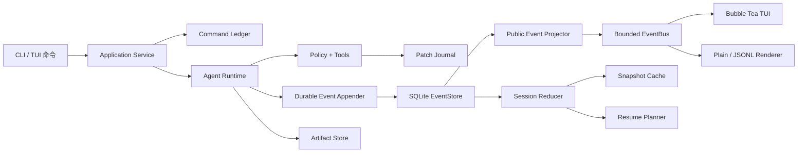
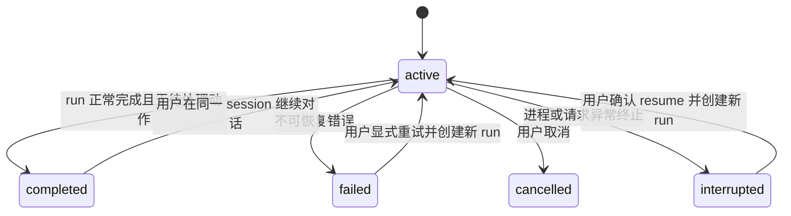
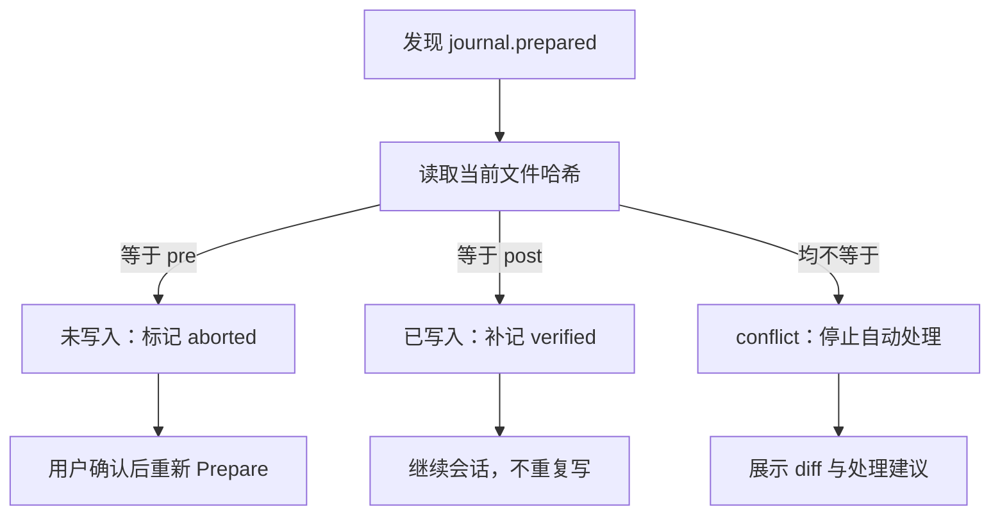

# MengDie Code 第二阶段详细设计

> 里程碑：M2 · 值得信任  
> 文档状态：已审核，实施中
> 适用版本：v0.1 开发阶段  
> 更新日期：2026-08-06

## 1. 结论先行

M2 不以“增加更多 Agent 能力”为第一目标，而是把 M1 已经能工作的单 Agent 变成一个中断后仍可解释、可恢复、可回滚的本地 Coding Agent。

实施顺序固定为：

1. 先建立 SQLite EventStore、迁移机制和单写者事务边界；
2. 再建立稳定 Command ID、会话重建和可恢复审批；
3. 在 M2 前半段接入消费同一事实流的完整 TUI；
4. 随后补齐 Artifact Store、上下文压缩、Patch Journal 与安全 rewind；
5. 最后接入项目指令、最小 Skill、用量与成本视图，并用故障注入完成 M2 退出评测。

核心约束：

- EventStore 是持久事实源，TUI、JSONL 和内存 EventBus 都不是事实源；
- 事实必须先提交，再广播；广播失败不能抹掉已发生的事实；
- Snapshot 只是加速器，删除 Snapshot 后仍能从事件重建关键状态；
- 恢复不是重放副作用：同一个 Command ID 不得重复执行工具；
- 写入中断必须先判断文件当前哈希，不能用旧补丁覆盖用户后续修改；
- 本地持久记录与公开事件投影分离，完整提示词、凭据和隐藏推理不得进入 TUI/JSONL；
- macOS 与 Windows 同为 Tier 1，不以任一平台为附属适配；Linux 保持 Tier 2 可构建与基础测试；
- 不提前实现 daemon、Web、子 Agent、向量记忆或自动复盘。

## 2. 用户痛点与成功定义

### 2.1 当前痛点

M1 的事件、Todo、审批和消息只在进程内存在。真实开发中一旦关闭终端、电脑休眠、网络中断或 Provider 超时，用户会遇到：

- 不知道 Agent 已经做了什么、还有什么未完成；
- 不知道某个工具到底执行成功、尚未执行，还是执行到一半；
- 无法安全恢复待审批动作，只能重新发起整项任务；
- 长工具输出反复塞回模型上下文，既贵又容易挤掉关键约束；
- 想撤销 Agent 修改时，无法区分 Agent 产物与用户之后的手工编辑；
- CLI 输出和未来 TUI 容易各自维护一套状态，出现“界面显示”和真实执行不一致。

### 2.2 M2 成功定义

M2 完成后，用户应能：

- 查看本机历史会话，并从最后一个可解释边界继续；
- 在恢复界面中看到中断原因、未完成步骤和待审批动作；
- 确认已完成工具不会因为恢复而重复执行；
- 对 Agent 写入执行安全 rewind；若文件已被继续编辑，系统明确报告冲突并停止；
- 在非 TTY、简单 CLI 和完整 TUI 之间看到一致的事实；
- 知道会话数据存在哪里、保存了什么，并能删除；
- 在 macOS 与 Windows 上获得一致的恢复与终端行为。

## 3. 进入条件、退出条件与不做范围

### 3.1 进入条件

M2 依赖以下 M1 基础，而不重新设计它们：

- 单 Agent Runtime、OpenAI-compatible Provider 与流式事件；
- read/grep/edit/write/shell/write_todos 工具；
- 项目根目录约束、TOCTOU 复验、Policy、Approval 与一次性 Capability；
- macOS/Windows 进程树终止与四目标 `CGO_ENABLED=0` 构建；
- plain、JSONL 与交互运行入口；
- 当前 `events.Event` 公共输出协议。

M1 外部真实仓库任务的最终退出证据仍单独追踪；M2 设计和基础设施不能被写成该证据已经完成。

### 3.2 退出条件

M2 必须同时满足：

1. 随机杀进程后，会话可被重建为 `interrupted`，不会伪造成正常完成；
2. 模型请求中断、待读审批、只读工具中断、写工具中断四类恢复路径均有自动化测试；
3. 重复提交相同 Command ID 不产生第二次工具副作用；
4. 删除或破坏 Snapshot 后，事件回放仍能重建关键会话状态；
5. EventBus 或 Renderer 故障不影响已提交事实，恢复后可补读；
6. rewind 只在当前文件哈希等于 Journal 记录的写后哈希时自动执行；
7. migration、磁盘满、数据库 busy、WAL 恢复和损坏 Snapshot 有故障注入；
8. macOS 与 Windows 均通过 EventStore、resume、approval、journal 与 TUI 验收；
9. 非 TTY/JSONL 保持可用，TUI 不成为执行前提；
10. 数据目录、删除命令、敏感字段约束和依赖清单有用户文档。

### 3.3 M2 明确不做

- daemon、多客户端写入、远程会话同步和 Web；
- 异步 Swarm、子 Agent、Agent 间消息协议；
- MCP 平台、插件市场和远程 Skill 安装；
- 向量数据库、记忆图谱和跨项目自动记忆；
- 自动修改正式规则的反思系统；
- 操作系统级强沙箱；
- 多设备数据库同步或云备份；
- 数据库透明加密承诺；没有完整密钥生命周期前不制造“已加密”的错觉。

## 4. 总体架构

### 4.1 写路径

1. Application Service 接收带稳定 ID 的 Command；
2. 在事务中登记 Command、Run 与首批事件；
3. Runtime 产生可重建的领域事实；
4. Appender 使用 `expectedSessionSeq` 原子追加并推进 Session 序号；
5. 提交成功后，由 Public Event Projector 生成脱敏的现有 `events.Event`；
6. EventBus 将投影交给 TUI、plain 或 JSONL Renderer；
7. 广播失败只产生可观察告警，不能回滚已经提交的事实。

### 4.2 读与恢复路径

1. 优先读取校验通过且版本兼容的 Snapshot；
2. 从 `snapshot.through_seq` 之后加载事件；
3. 通过纯 Reducer 重建 Session View；
4. Resume Planner 根据最后的模型、审批和工具阶段给出允许动作；
5. TUI 与 CLI 读取同一个 Session View，不直接拼装数据库行。

### 4.3 两种事件不可混淆

M1 的 `internal/events.Event` 是公开渲染协议，`Seq` 当前为 Run 内单调序号。M2 新增的持久记录是内部领域事实，必须另建类型，不能直接给现有结构塞入完整提示词。

| 概念 | 用途 | 是否可含本地敏感内容 | 顺序 |
|---|---|---:|---|
| `session.Record` | EventStore、回放、恢复 | 仅受控字段允许 | `SessionSeq` 单调 |
| `events.Event` | TUI、plain、JSONL 实时输出 | 否 | 保留 Run 内 `Seq` |
| `SessionView` | Reducer 产出的只读状态 | 已按用途裁剪 | 来自持久事实 |

公开事件协议暂不改变 `Seq` 语义。若需要暴露会话定位，只能增加可选 `session_id` 与 `session_seq`，并以兼容测试保护现有 JSONL 消费方。

## 5. 领域模型与状态机

### 5.1 Session、Run 与 Command

- **Session**：围绕同一项目目标持续的本地会话，可跨进程包含多个 Run；
- **Run**：一次模型循环，从开始到完成、失败、取消或中断；
- **Command**：用户或系统提交给 Application Service 的幂等意图；
- **Record**：已经发生、不可原地修改的持久事实；
- **Snapshot**：从事实投影出的缓存；
- **Artifact**：体积较大的原始输出或上下文材料；
- **Patch Journal**：写工具前后状态与回滚材料。

Command ID 在客户端未提供时由 CLI 生成 UUIDv7，并在重试时复用。命令 Payload 使用规范 JSON 后计算 SHA-256；相同 ID 不同哈希必须拒绝，不能把它当作同一命令。

### 5.2 Session 状态

启动时发现上次仍为 `active` 的 Session/Run，不直接改写旧事件；系统在取得数据库写锁并确认无活跃进程后追加 `run.interrupted`。恢复总是创建新 Run，不冒充从旧 HTTP 流的中间 token 继续。

### 5.3 Command 状态

`accepted → running → applied | rejected | failed | interrupted`

- `accepted`：Command ID 与 Payload 已持久化；
- `running`：已创建 Run；
- `applied`：命令的业务结果已由事件确认；
- 终态命令再次提交时返回原结果引用；
- `running/interrupted` 命令再次提交时进入 Resume Planner，不能直接重跑工具。

### 5.4 Approval 状态

`pending → approved | rejected | expired | interrupted`

- 恢复 `pending` 审批时重新展示原始脱敏预览；
- 永不自动批准，也不沿用旧 Capability；
- 用户确认后基于当前文件、路径、环境和调用参数重新 Prepare；
- 任何摘要变化都生成新的 Approval ID；
- 数据库只记录决定与规范化摘要，不记录密钥值。

### 5.5 工具执行阶段

| 最后持久事实 | 恢复判断 | 默认动作 |
|---|---|---|
| `tool.proposed` | 尚未授权 | 重新进入 Policy/Approval |
| `approval.needed` | 等待用户 | 恢复审批卡片，不自动批准 |
| `tool.started`，只读 | 结果未知 | 标记中断；用户可重试同一逻辑动作 |
| `journal.prepared`，文件哈希等于 pre | 写入未发生 | 标记中止，可重新 Prepare |
| `journal.prepared`，文件哈希等于 post | 写入发生、提交记录未完成 | 补记 `applied/verified`，不重复写 |
| `journal.prepared`，哈希均不匹配 | 用户或外部程序继续修改 | 标记 conflict，等待用户处理 |
| `tool.completed` | 已完成 | 回放结果，禁止重复副作用 |

## 6. SQLite 数据设计

以下是逻辑 schema；P2-02 通过迁移 SQL 固化列类型、索引与约束。时间统一存 UTC RFC3339Nano 文本，ID 为固定格式文本，JSON 必须经过严格解码和大小限制。

### 6.1 `sessions`

| 字段 | 约束 | 说明 |
|---|---|---|
| `id` | PK | Session ID |
| `project_root` | NOT NULL | 本机规范绝对路径，敏感、不可公开广播 |
| `project_identity` | NOT NULL | repo remote/根目录指纹的非秘密摘要 |
| `title` | NULL | 用户可见标题，不由隐藏推理生成 |
| `status` | CHECK | active/completed/failed/cancelled/interrupted |
| `last_seq` | NOT NULL | Session 已提交的最后序号 |
| `snapshot_seq` | NOT NULL | 已验证 Snapshot 覆盖序号 |
| `created_at` / `updated_at` | NOT NULL | UTC 时间 |

### 6.2 `runs`

| 字段 | 约束 | 说明 |
|---|---|---|
| `id` | PK | Run ID |
| `session_id` | FK | 所属 Session |
| `command_id` | FK | 触发命令 |
| `status` | CHECK | running/completed/failed/cancelled/interrupted |
| `provider` / `model` | NOT NULL | 只存标识，不存 API Key |
| `last_run_seq` | NOT NULL | 兼容公开事件的 Run 内序号 |
| `started_at` / `finished_at` | 时间 | 生命周期 |

### 6.3 `commands`

| 字段 | 约束 | 说明 |
|---|---|---|
| `id` | PK | 稳定幂等键 |
| `session_id` | FK | 所属 Session |
| `kind` | NOT NULL | submit/resume/approve/reject/rewind 等 |
| `payload_json` | NOT NULL | 本地私有内容，严格限长 |
| `payload_sha256` | NOT NULL | 防止同 ID 不同意图 |
| `status` | CHECK | accepted/running/applied/rejected/failed/interrupted |
| `result_seq` | NULL | 结果事实序号 |
| `created_at` / `updated_at` | NOT NULL | UTC 时间 |

用户原始任务文本只有在 resume 确实需要时才进入私有 Command Payload；它不得被 Public Event Projector 直接输出。Provider Key、Authorization Header、进程环境和隐藏推理任何时候都不得落库。

### 6.4 `events`

| 字段 | 约束 | 说明 |
|---|---|---|
| `event_id` | PK | 全局唯一事件 ID |
| `session_id`, `session_seq` | UNIQUE | Session 内严格单调事实序号 |
| `run_id`, `run_seq` | UNIQUE，允许系统事件为空 | Run 内公开顺序 |
| `command_id` | NULL/FK | 关联命令 |
| `kind` | NOT NULL | 稳定事件名 |
| `schema_version` | NOT NULL | 单事件 payload 版本 |
| `visibility` | CHECK | private/public/metadata |
| `payload_json` | NOT NULL | 规范 JSON；按 kind 限长 |
| `created_at` | NOT NULL | 事实提交时间 |

`message.delta` 允许在内存中高频广播，但持久化必须批量合并；`message.completed` 是完整助手消息的可重建边界。未知事件必须保留并跳过，旧程序不能因为看到新事件而破坏历史。

### 6.5 `snapshots`

| 字段 | 约束 | 说明 |
|---|---|---|
| `session_id` | PK/FK | 每 Session 当前 Snapshot |
| `through_seq` | NOT NULL | 已覆盖事实序号 |
| `schema_version` | NOT NULL | Snapshot reducer 版本 |
| `state_json` | NOT NULL | 可丢弃派生状态 |
| `state_sha256` | NOT NULL | 损坏检测 |
| `created_at` | NOT NULL | 生成时间 |

Snapshot 保存使用 compare-and-swap：只有 `through_seq` 不倒退时才能替换。版本不兼容、哈希不符或解码失败时删除缓存并全量回放，不修改原始事件。

### 6.6 `approvals`

| 字段 | 说明 |
|---|---|
| `id`, `session_id`, `run_id`, `command_id` | 关联身份 |
| `tool_call_id`, `call_digest`, `preview_json` | 规范调用摘要与脱敏预览 |
| `status`, `decision` | pending/approved/rejected/expired/interrupted |
| `requested_at`, `resolved_at` | 生命周期 |

Capability 本身不持久化；恢复后必须重新绑定当前状态并签发一次性 Capability。

### 6.7 `artifacts`

| 字段 | 说明 |
|---|---|
| `id`, `session_id`, `run_id` | 身份与归属 |
| `kind`, `mime`, `sensitivity` | tool-output/context-summary/diff 等 |
| `relative_path` | 相对受控 Artifact 根目录，禁止任意绝对路径 |
| `sha256`, `size_bytes` | 完整性与配额 |
| `created_at`, `expires_at`, `deleted_at` | 生命周期 |

数据库只保存索引和摘要，大内容落独立文件。写入顺序为临时文件、`fsync`、原子 rename、数据库登记；登记失败时清理孤儿文件，启动时也执行可审计的孤儿扫描。

### 6.8 `patch_journals` 与 `patch_entries`

Journal 头记录 Session/Run/Command、工具调用、状态和时间；每个 Entry 记录：

- 项目内相对路径与规范路径指纹；
- 写前是否存在、`pre_sha256` 与模式信息；
- 写后是否存在、`post_sha256`；
- 正向/反向补丁的 Artifact 引用；
- `prepared/applied/verified/rewound/conflict/aborted` 状态；
- rewind 时间与冲突说明。

不把完整文件内容无限复制进 SQLite；小补丁可内联，大补丁进入 Artifact Store 并受配额管理。

### 6.9 `schema_migrations`

每条嵌入式 migration 记录递增版本、名称、SHA-256 与执行时间。迁移规则：

- 使用 `//go:embed migrations/*.sql`，发布产物不依赖外部 SQL 文件；
- 启动时校验已执行 migration 的校验和，不一致立即失败；
- v0.1 默认只做可回滚的增量迁移，不自动做破坏性降级；
- 单条 migration 在事务中执行，失败不提升 schema 版本；
- 可能重写大表前先通过独立版本完成备份、空间检查与故障注入；
- 新程序打不开数据库时给出数据位置、版本与恢复建议，不静默创建空库覆盖。

## 7. 事务、一致性与并发

### 7.1 原子追加

`Append(sessionID, expectedSeq, records)` 在一个事务中：

1. 读取并比较 `sessions.last_seq`；
2. 校验批次序号连续、ID 唯一、Payload 合法；
3. 插入 Records；
4. 推进 Session/Run 状态与最后序号；
5. 提交后才把公开投影送入 EventBus。

序号不匹配返回明确的并发冲突，调用方重新加载事实后再决定，而不是覆盖。

### 7.2 单写者策略

v0.1 只支持单进程写一个数据库：

- `database/sql` 写连接初始设为 `MaxOpenConns(1)`；
- SQLite 启用 `foreign_keys=ON`、WAL 与有限 `busy_timeout`；
- 连接级 PRAGMA 必须通过 DSN/连接初始化对每条实际连接设置并复验，不能只对连接池中的偶然一条连接执行；
- 持久事实优先采用 `synchronous=FULL`，P2-02 用 macOS/Windows 延迟数据决定是否允许可配置 `NORMAL`；
- 读操作可使用独立只读连接，但 TUI 不直接持有事务；
- 第二个写进程得到明确“数据库正在使用”错误，不等待到用户误以为卡死。

daemon 或多客户端出现前不设计分布式锁和多写者协调。

### 7.3 SQLite 与文件系统不是一个事务

Artifact 和项目文件无法与 SQLite 真正原子提交，因此使用“意图记录 + 哈希核验 + 可恢复状态机”，不宣称跨介质 ACID：

- Artifact：先写临时文件并落盘，再登记；
- 项目写入：先提交 `journal.prepared`，再原子替换文件，随后提交 `applied/verified`；
- 每个间隙都有基于 pre/post 哈希的恢复分支；
- 任何模糊状态都进入 `conflict`，不自动猜测。

## 8. 恢复语义

### 8.1 模型请求中断

- 将旧 Run 标记为 `interrupted`；
- 不拼接不完整 delta 伪造助手消息；
- 已有 `message.completed` 可进入恢复上下文；
- 用户确认后创建新 Run，由模型基于持久上下文继续；
- Provider 不支持请求幂等时，不尝试恢复旧 HTTP 请求。

### 8.2 审批中断

- 恢复原审批卡片与风险说明；
- 重新解析路径、环境、参数和文件哈希；
- 旧 Capability 永久失效；
- 当前状态改变时提示“需重新审批”，生成新摘要。

### 8.3 只读工具中断

只读工具可以由用户确认后重试，但结果必须作为新事实写入。不能根据“看起来像执行过”推断已完成。

### 8.4 写工具中断

### 8.5 安全 rewind

rewind 的自动前提是：

- Journal 已 `verified` 且未 rewind；
- 当前路径仍在原项目根内；
- 当前内容哈希严格等于 `post_sha256`；
- 反向补丁能在临时文件中完整应用；
- 用户显式确认高风险删除或覆盖。

若任一条件失败，只生成冲突报告和人工操作建议。成功 rewind 也作为新 Command 和新事实记录，不能删除旧历史。

## 9. Artifact 与上下文压缩

### 9.1 Artifact Store

- 工具输出超过事件上限时落盘，事件只保留摘要、哈希和 Artifact ID；
- 默认不把二进制、`.git`、凭据文件或项目外内容复制进 Artifact；
- 每 Session 与全局都设置字节配额；超限先拒绝新大 Artifact，不静默删正在使用的数据；
- Artifact 文件名由内部 ID 派生，不使用用户输入；
- `session delete` 同时删除数据库记录和 Artifact，失败时报告剩余路径。

### 9.2 上下文层级

1. 系统与安全约束；
2. 用户当前任务和明确项目指令；
3. 最近完整消息；
4. Todo、审批、工具结果摘要；
5. 按需读取的 Artifact；
6. 可验证的滚动摘要。

压缩只改变发给模型的上下文，不改写原始历史。摘要记录来源事件区间、生成模型、版本和哈希；恢复时若摘要缺失，可从原始事实重新生成。M2 摘要不是长期记忆，也不自动跨项目复用。

## 10. 数据目录、权限与隐私

### 10.1 默认目录

提供 `MENGDIE_DATA_DIR` 显式覆盖。默认位置：

| 平台 | 数据目录 |
|---|---|
| macOS | `~/Library/Application Support/MengDie Code/` |
| Windows | `%LOCALAPPDATA%\MengDie Code\` |
| Linux | `$XDG_STATE_HOME/mengdie/`，未设置时 `~/.local/state/mengdie/` |

目录包含 `state.db`、WAL/SHM、`artifacts/` 和受控备份。它与项目配置、临时缓存分离，不能放在仓库内，也不能依赖当前工作目录。

### 10.2 权限

- Unix 新目录申请 `0700`、文件申请 `0600`，创建后复验；
- Windows 使用当前用户目录和默认 ACL，并检测明显的共享/不可写位置；
- M2 只支持本机文件系统；网络共享以及 OneDrive/iCloud 等同步目录必须给出警告并拒绝作为默认数据库位置；
- 不跟随数据根目录自身的 symlink/reparse point；
- 所有内部相对路径再次经过 root-anchored 解析；
- `doctor` 显示数据位置、schema 版本、占用空间和权限警告，但不输出敏感内容。

### 10.3 敏感信息规则

永不持久化：

- API Key、Authorization Header、Cookie、环境变量值；
- 隐藏推理、Provider 内部字段；
- 未脱敏的 shell 环境；
- Approval Capability 或可重放授权。

可能包含用户代码或任务文本的字段必须标为 private，只供恢复路径读取。公开事件由白名单投影生成，不能依赖“先全部序列化再正则脱敏”。M2 提供明确的列举、删除与数据位置命令；数据库静态加密留待独立威胁模型和密钥生命周期设计。

## 11. TUI 详细边界

### 11.1 为什么放在 M2 前半段

完整 TUI 需要展示历史、恢复、审批、diff、Todo 和成本。如果先于 EventStore 实现，它必然把内存 Model 变成第二事实源。因此顺序固定为：EventStore → Resume/Approval 事实 → TUI。

### 11.2 交互模型

TUI 只依赖 Application Service：

- `LoadSession(sessionID, afterSeq)` 获取回放；
- `Subscribe(sessionID, afterSeq)` 获取提交后的公开事件；
- `Submit(Command)` 发出用户意图；
- 断流或检测到序号缺口时，从 EventStore 补读；
- Bubble Tea Model 不直接访问 SQLite、Provider 或文件工具。

计划视图：

- 会话列表与恢复状态；
- 主消息/事件时间线；
- Todo 与当前执行阶段；
- Approval 与 diff 预览；
- Provider、模型、上下文占用、token 与成本；
- 安全模式、项目根和数据持久化状态。

### 11.3 终端兼容

- TTY 默认进入 TUI；`--plain`、`--json` 和管道场景保持非交互；
- 支持 resize、窄终端、无颜色、低色深和键盘退出；
- Windows 重点验证 Windows Terminal 与 PowerShell，macOS 验证 Terminal 与 iTerm2；
- 中文宽字符、emoji、组合字符和粘贴必须有回归样例；
- 动画服从 reduced-motion/简单模式，关键状态不能只用颜色表达；
- TUI 崩溃不得终止已安全持久化的会话事实。

## 12. 依赖决策

候选版本是 2026-08-06 的核验快照。P2-02 已采用 `modernc.org/sqlite` v1.56.0，其余候选仍不写入 `go.mod`。

| 能力 | 首选 | 核验结论 | 采用门禁 |
|---|---|---|---|
| SQLite | [`modernc.org/sqlite`](https://pkg.go.dev/modernc.org/sqlite) v1.56.0 | `database/sql`、纯 Go、维护活跃，适合现有 CGO=0 分发 | 四目标构建、WAL/故障注入、二进制体积、性能、许可证与 `govulncheck` |
| SQLite 备选 | [`ncruces/go-sqlite3`](https://github.com/ncruces/go-sqlite3) v0.35.3 | 无 CGO、MIT、维护活跃；近期版本修复 Windows WAL 高并发损坏，说明仍需强回归 | 仅当首选门禁失败时做同等 spike，不混用驱动 |
| TUI 核心 | [`charm.land/bubbletea/v2`](https://github.com/charmbracelet/bubbletea/releases) v2.0.8 | v2 稳定、现代消息循环、活跃维护 | Windows/macOS 终端、退出恢复、事件缺口和大输出压力测试 |
| TUI 组件 | [`charm.land/bubbles/v2`](https://github.com/charmbracelet/bubbles/releases) v2.1.1 | 与 Bubble Tea v2 配套 | 只引入实际使用组件 |
| TUI 样式 | [`charm.land/lipgloss/v2`](https://github.com/charmbracelet/lipgloss) v2.0.5 | 声明式样式、MIT、活跃维护 | 中文宽度、低色深、无颜色与 Windows 渲染 |
| migration | 内嵌 SQL + 自有小型 runner | 当前迁移需求线性且受控 | 出现分支迁移或复杂运维前不引入框架 |

不选 `mattn/go-sqlite3` 作为首选，不是成熟度不足，而是它要求 CGO，会直接破坏当前四目标纯 Go 预览链路。核心层只依赖由使用方定义的 Store 接口，第三方 driver 和 TUI 类型不得扩散到领域模型。

## 13. 可测试实施切片

### P2-01：详细设计（本切片）

- 固定事实源、schema、恢复状态机、平台策略、依赖门禁和实施顺序；
- 只改文档，不把任何能力标记为已实现。

### P2-02：SQLite 基础与 EventStore

- 独立依赖 spike 后引入 SQLite driver；
- 数据目录、连接配置、migration 与 schema v1；
- 持久化现有完成边界事件，提交后再广播；
- EventStore 集成测试、序号冲突、busy、磁盘故障、四目标构建；
- 不在该切片承诺完整 resume 或 TUI。

### P2-03A：Command Ledger、Reducer/Snapshot 与会话查看

- Session/Run/Command、Snapshot 与纯 Reducer；
- CLI 历史列表、查看和显式确认删除；
- 终态 Command 重试只回放公开事实，不再次调用 Provider/工具；
- 完整任务只存入私有 Command payload，公开投影不暴露；
- 不在本切片承诺 resume、审批恢复或写工具未知状态续跑。

### P2-03B：恢复核心

- P2-03B1：私有上下文日志、CLI resume、同 Session 新 Run 与模型边界恢复；
- P2-03B2：pending Approval 重新确认、模型中断解释与执行中只读工具重试；
- 写入状态未知时先安全阻断，不在 Journal 完成前自动续写。

### P2-04：事件驱动完整 TUI

- 引入 Bubble Tea/Bubbles/Lip Gloss v2；
- 会话、时间线、Todo、Approval/diff、状态栏；
- EventStore 回放 + EventBus 实时，序号缺口自动补读；
- macOS/Windows 真实终端验收，plain/JSONL 兼容回归。

### P2-05：Artifact Store 与上下文压缩

- 大输出落盘、配额、完整性和孤儿清理；
- token 预算、滚动摘要、来源区间与按需回填；
- 压缩前后任务约束保持评测和成本对比。

### P2-06：Patch Journal 与 rewind

- 写前意图、pre/post 哈希、崩溃恢复与冲突报告；
- edit/write 的 Journal 接入；
- rewind 命令、审批、用户后续编辑保护；
- kill-point 与 TOCTOU 组合测试。

### P2-07：项目指令与最小 Skill

- 项目级/用户级 AGENTS.md 与 `SKILL.md` 的明确加载顺序；
- 按需加载、大小上限、来源展示和冲突诊断；
- 不执行 Skill 中的隐式授权，不自动联网安装。

### P2-08：用量、成本与 M2 退出评测

- token/缓存 token/请求次数的持久事实；
- 成本基于带版本的本地价格表，未知价格明确显示未知；
- 随机 kill、resume、审批、journal、TUI、双平台完整验收；
- 退出报告区分模拟故障与真实 Provider 证据。

每个切片都必须先在 Beads 建立验收项，完成后运行适用的 `go fmt ./...`、`go vet ./...`、`go test ./...`；依赖变化额外运行 `go mod tidy`、`govulncheck ./...`、许可证检查和四目标构建。

## 14. 测试与评测矩阵

| 风险 | 必测场景 | 通过标准 |
|---|---|---|
| 事件丢失 | commit 前后分别 kill | commit 前无半条事实；commit 后可回放 |
| 重复副作用 | 同 Command ID 重提 2–10 次 | 工具副作用最多一次 |
| 顺序冲突 | 并发 expectedSeq | 一个成功，其余明确冲突 |
| Renderer 故障 | JSONL/TUI 写失败 | EventStore 事实完整，可重新消费 |
| Snapshot 损坏 | 改哈希、截断、旧版本 | 自动退回事件全量回放 |
| 审批恢复 | pending 时 kill | 重显且重新校验，绝不自动批准 |
| 写入间隙 | Journal 与 rename 各 kill point | pre/post/conflict 三路判断准确 |
| 用户后续编辑 | 写后手改再 rewind | 自动 rewind 被拒绝，不覆盖手改 |
| Artifact 中断 | tmp、rename、登记间 kill | 无静默丢失，可清理孤儿 |
| SQLite 压力 | busy、WAL、磁盘满、只读目录 | 有界等待、明确错误、无损坏 |
| 隐私 | prompt/API Key/环境值注入 | JSONL/TUI/日志不出现禁存内容 |
| 跨平台 | macOS/Windows 四构建与真实终端 | 行为一致，差异有文档和测试 |
| TUI 降级 | 非 TTY、窄屏、无颜色 | 可操作，plain/JSONL 不回归 |

评测不能只检查“最终文件对了”，还要检查事件序列、Command 去重、审批边界、Journal 状态和用户可解释性。

## 15. 可观测性与错误呈现

- 错误包含稳定类别、用户可执行建议和内部 cause，不输出敏感 Payload；
- `doctor` 报告数据库版本、迁移状态、WAL、占用空间、权限和最近一次干净关闭；
- 每次 resume 显示“哪些事实已确认、哪些动作状态未知、为什么允许或禁止继续”；
- EventStore 指标以本地诊断为主，不默认遥测上报；
- cost 显示估算来源与价格表版本，不能用估算冒充账单。

## 16. 开放决策与审核重点

以下内容在各自实现切片通过 spike/评测后固化，不阻塞本设计审核：

1. `modernc.org/sqlite` 在四目标的二进制体积与 WAL 延迟是否可接受；
2. `synchronous=FULL` 是否需要提供明确的性能档位，默认仍以事实耐久为先；
3. Artifact 默认全局/单会话配额的具体数值；
4. 完整用户消息的保留策略与未来静态加密方案；
5. TUI 默认启动条件和无障碍快捷键；
6. 成本价格表的更新与签名机制。

审核本设计时应重点确认：

- TUI 是否确实晚于事实源且不直连数据库；
- 写入中断是否覆盖所有 pre/post/conflict 路径；
- 私有持久事实与公开事件是否真正隔离；
- M2 切片是否足够小，每片都有调用方和独立验收；
- 是否有任何规划能力被误写为已经实现。

## 17. 当前实现状态

截至本文更新：P2-03B1 已在 P2-03A 上实现带顺序/SHA-256 的私有上下文日志、store-first 模型边界、同 Session 新 Run、确定性 Resume Analyzer 和 `session resume`。完整 user/assistant/只读工具消息可恢复，副作用工具只保存脱敏摘要；无日志、上下文缺口、未决审批、未完成工具和跨项目请求均 fail-closed。重复恢复 Command ID 只回放该 Run 的公开事实。`message.delta` 仍不落库；pending Approval 重新确认、执行中只读工具重试、未知写状态处理、Artifact、Patch Journal、完整 TUI、成本持久化与 M2 退出评测均尚未实现。README 里的 M2 复选框必须保持未完成，直到上述退出条件全部满足。
